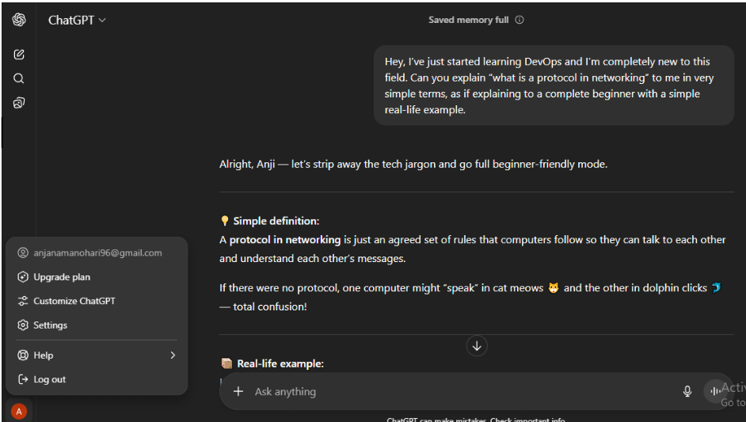
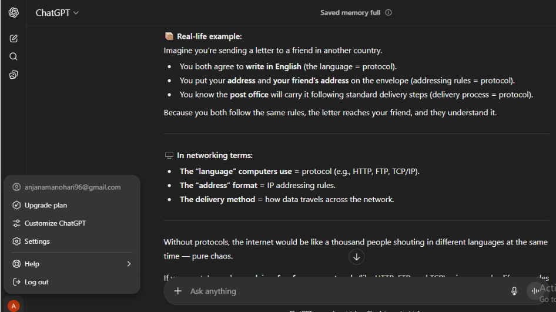
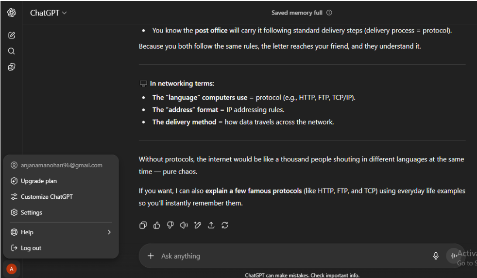
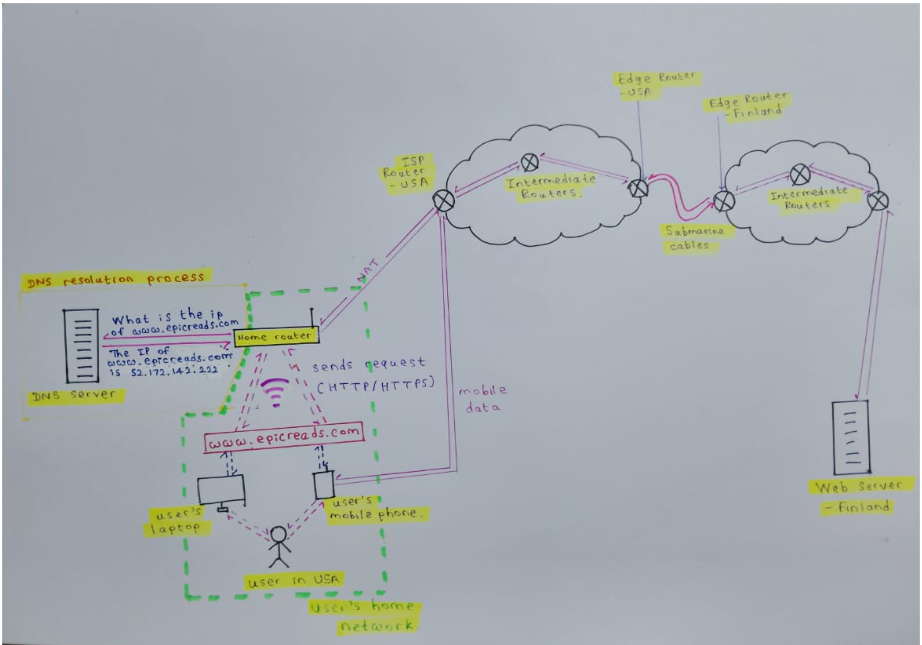
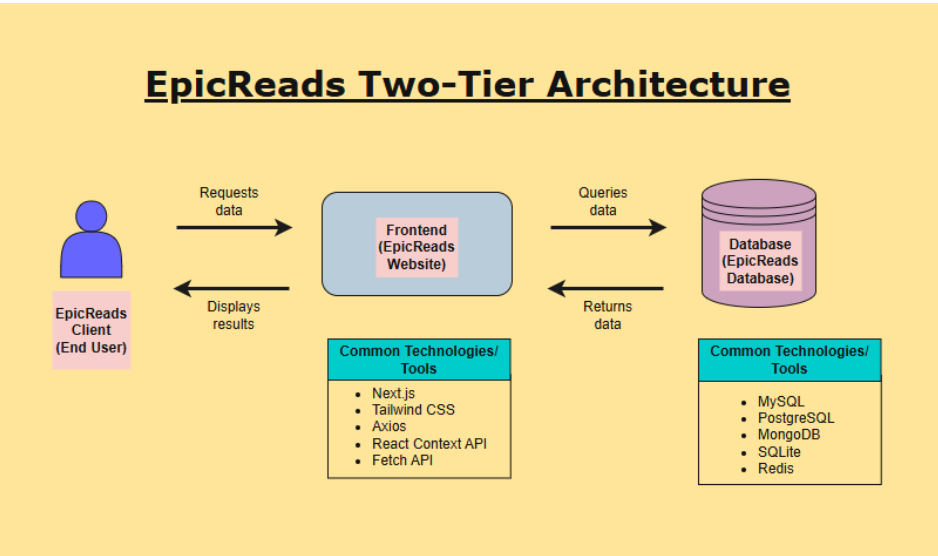
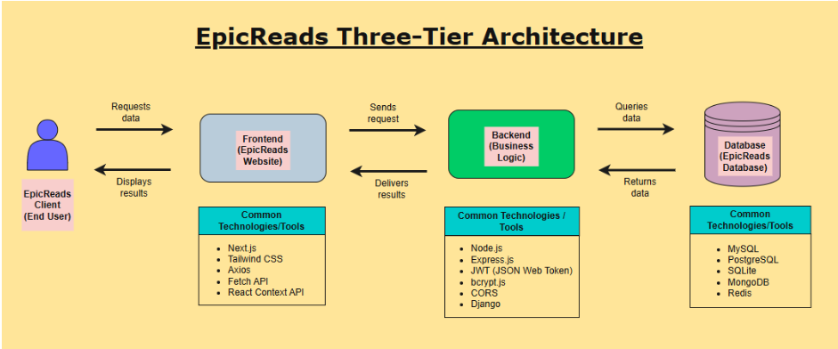
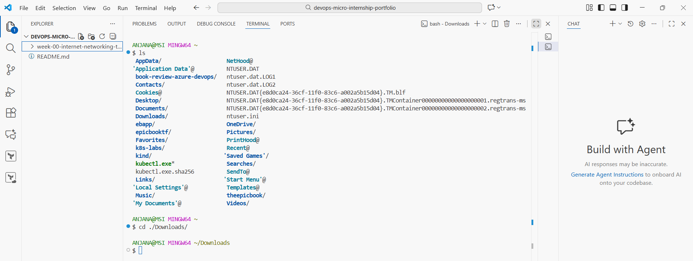

# Week 0 – Basic Understanding of Internet, Networking & Tools Basics

This week covers the fundamental concepts needed before diving deeper into DevOps.  
Below are all the tasks, explanations, screenshots, and results I completed as part of the **DevOps Micro Internship (DMI Cohort)**.

---

## 🧑‍💻 Task 1: Using ChatGPT as Your Learning Assistant

### Objective
Learn how to use ChatGPT effectively to understand technical concepts.

### What I Did
- Created a clear prompt asking ChatGPT:  
  **“What is a protocol in networking? Explain with a simple real-life example.”**
- Explained expectations clearly in the prompt.
- Received a simplified answer from ChatGPT.
- Took screenshots of:
  - My detailed prompt  
  - ChatGPT’s response  

📁 **Screenshots:**  

 <br>

 <br>

 <br>

---

## 🌐 Task 2: Internet & Networking Explanation

### Given Scenario
Friend is launching an online bookstore *EpicReads* hosted in Finland.  
I had to explain how users from anywhere (e.g., USA) can access the website.

### My Answer
The EpicReads website is hosted on a server in Finland. The user is trying to access it from the USA using their device. Both the web server and the user’s device have unique IP addresses. An IP address is an identifier assigned to each device on the internet. The user types the website URL, the device sends a request to the web server. This request first goes to the home router and splits into small data packets. Then they route via different paths through the home router, ISPs, and international fiber cables. The IP address ensures each packet reaches the correct server. At the server, the packets are reassembled, and the server receives the request. This process is called "Packet switching". Then the same process happens vice versa when the server is responding to that request. Protocols are the rules for transferring data. If any packet is lost, TCP detects and requests it again to ensure reliability. IP handles routing. For web browsing, we use HTTP or HTTPS, where HTTPS adds encryption for secure communication.

 <br>

---

## 🏗️ Task 3: Application Architecture (2-Tier & 3-Tier)

### What I Did
- Created diagrams showing:
  - **Two-tier architecture**: Frontend + Database  
  - **Three-tier architecture**: Frontend + Backend + Database  
- Added labels for each layer.
- Listed technologies used in each layer.

### Example Technologies
| Layer | Technologies |
|-------|-------------|
| Frontend | HTML, CSS, React |
| Backend | Node.js, Python Flask, Java Spring |
| Database | MySQL, PostgreSQL, MongoDB |

📁 **Diagrams:** 

<br>

<br>

---

## 🌍 Task 4: Domain Name & DNS

### My Answer
My friend’s bookstore, EpicReads, can be accessed via IP address `52.172.142.222:3000`, but that’s not user-friendly. Instead, he purchased the domain `epicreads.com`, which is easier to remember. The Domain Name System (DNS) works like the internet’s phonebook; when a user types a domain name, DNS returns its corresponding IP address through the DNS resolution process. To connect the domain to the IPv4 address, an **A Record** should be used because it maps domain names to IPv4 addresses.

---

## 💻 Task 5: Visual Studio Code Setup

### What I Did
- Installed VS Code.
- Opened terminal inside VS Code.
- Ran basic commands (`dir`, `pwd`, or `ls`).
- Selected a theme.
- Took a screenshot showing:
  - Terminal  
  - Selected theme  
  - Visible user details  

📁 **Screenshots:**  

<br>
---

## 🔗 Task 6: LinkedIn Post

### What I Did
- Summarized tasks 1–5.
- Structured the post into sections.
- Added the mandatory credit note.
- Published on LinkedIn.

🔗 **LinkedIn Post:** 
[Post 1](https://www.linkedin.com/posts/anjana-muthunayake_devops-for-beginnersweek-0assignmentanjana-activity-7362170877381132290-rWjP) <br>

[Post 2](https://www.linkedin.com/posts/anjana-muthunayake_how-does-communication-really-happen-between-activity-7363831961938755584-7fS-?utm_source=share&utm_medium=member_desktop&rcm=ACoAADfZ4q8BKp1Dptghjo7ucKUr-n4bgkwr7Kg)


---

## 📁 Folder Structure for Week 0

```
week-00-internet-networking-tools-basics/
├── README.md
└── figures/
    ├── task1/
    ├── task2/
    ├── task3/
    └── task5/

```


