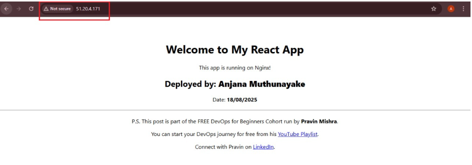

# Week 1 – AWS & Linux Environment Setup

This week focuses on **setting up a cloud-based Linux environment using AWS**, deploying a React app, and practicing Linux administration tasks.  

The assignments for this week include:

1. **Assignment 2:** AWS Free Tier Account Setup  
2. **Assignment 3:** Deploy a React App on Ubuntu VM Using Nginx  
3. **Assignment 4:** Linux Administration Practice (Networking, Process Monitoring & System Info)

---

## Assignment 2 – AWS Free Tier Account Setup

**Objective:**  
Create an AWS account and explore the AWS Management Console to gain hands-on experience with cloud services before building the EpicReads bookstore infrastructure.

**Task 1 – Understanding AWS & Free Tier**

- **What is an AWS account, and why do you need it?**  
  An AWS account is a container for creating and managing AWS resources and identities. At this stage, it allows me to explore the AWS Management Console and practice using essential services before deploying cloud infrastructure.

- **What is the AWS Free Tier, and how long does it last?**  
  The AWS Free Tier lets users try certain AWS services at no cost, within usage limits.  
  - **12 Months Free:** 12 months from account creation  
  - **Free Trial:** Limited-time free usage per specific service  
  - **Always Free:** Free usage until the defined limit is exceeded  

- **Examples of AWS Free Tier services:**

| Service | Free Usage Limit |
|---------|----------------|
| **Amazon EC2** | 750 hours/month of t2.micro (or t3.micro) instances |
| **Amazon S3** | 5 GB standard storage, 20,000 GET/PUT/COPY/POST/LIST requests, 100 GB data transfer out per month |
| **CloudFront (CDN)** | 1 TB data transfer out/month, 10 million HTTP/HTTPS requests, 2 million function invocations, 2 million KeyValueStore reads |

---

## Assignment 3 – Deploy React App on Ubuntu VM Using Nginx

**Objective:**  
Deploy a React app on an Ubuntu VM and serve it using Nginx.

**Tasks Completed:**  
- Installed Node.js, npm, and Nginx on Ubuntu VM  
- Cloned the React app repository  
- Built the app and deployed it to `/var/www/html`  
- Configured Nginx to serve the app from the VM’s public IP  

## Deployment Details

For step-by-step instructions on deploying the React app on Ubuntu using Nginx, see the [Deployment Guide](./assignment-3-deployment.md)

   

### Related Content

- **LinkedIn Post:** [DevOps Journey – Week 1 React App Deployment](https://www.linkedin.com/posts/anjana-muthunayake_devops-careergrowth-learndevops-activity-7363216274828541952-xrZX)  

- **Medium Blog:** [Week 1 – Deploy React App on Ubuntu VM](https://lnkd.in/g5rk3tYj)

---

## Assignment 4 – Linux Administration Practice

👉 **Full Detailed Task File:**  
[Assignment 4 – Linux Administration Practice](./assignment-4-linux-admin.md)

**Objective:**  
Perform post-deployment Linux administration tasks to strengthen troubleshooting skills, including networking, process monitoring, and system information commands.

---

### Task 1 – Networking Commands

| Command | Description | Usefulness |
|---------|-------------|------------|
| `ifconfig` | Displays all network interface configurations and statuses | Helps check server connectivity, IP addresses, and detect network issues |
| `ping -c 4 thecloudadvisory.com` | Sends 4 ICMP packets to test connectivity | Confirms server or domain reachability and network latency |
| `sudo netstat -tulnp` | Lists all open ports and listening services | Monitors running services and helps troubleshoot connectivity issues |
| `dig pravinmishra.in` | Queries DNS info for a domain | Verifies DNS configuration and server accessibility |
| `host pravinmishra.in` | Performs DNS lookup for a domain | Confirms correct IP address for website/server |
| `wget -O /tmp/Untitled-design-40.png <URL>` | Downloads a file from the internet to server | Automates downloading resources needed for projects or scripts |

---

### Task 2 – Process Monitoring & Control

| Command | Description | Usefulness |
|---------|-------------|------------|
| `ps -e` | Lists all running processes | Monitors active processes and ensures critical services are running |
| `ps aux | grep nginx` | Filters processes for Nginx | Confirms Nginx service is running and monitors resource usage |
| `pstree` | Shows process hierarchy | Visualizes parent/child process relationships for troubleshooting |
| `kill <PID>` | Terminates a process safely | Stops unresponsive processes to maintain server performance |

---

### Task 3 – System Information

| Command | Description | Usefulness |
|---------|-------------|------------|
| `uname -a` | Shows OS, kernel, architecture, and hostname | Identifies server environment for troubleshooting |
| `uptime` | Displays system uptime, active users, and load average | Monitors server availability and performance trends |
| `who` | Lists currently logged-in users | Tracks user activity and identifies unauthorized access |
| `free -h` | Displays memory usage in human-readable format | Detects memory bottlenecks and ensures smooth operation |
| `df -h` | Shows disk usage of mounted file systems | Monitors storage availability and prevents disk full issues |
| `sudo du -sh /var/*` | Displays size of directories/files in `/var` | Identifies large files/directories to optimize disk usage |

---

## Skills Gained

- Exploring AWS Free Tier and cloud environment basics  
- Launching and managing EC2 instances  
- Deploying React apps on Ubuntu with Nginx  
- Basic Linux system administration: networking, processes, memory, disk, users  
- Troubleshooting and monitoring server performance and availability

