# Deployment Guide – React App on AWS EC2 (Ubuntu + Nginx)

This guide explains how to deploy a React application on an Ubuntu EC2 instance using Nginx.  
Each step includes commands, screenshots, and explanations for why it is required.

---

## Architecture Overview

A simple representation of the deployment architecture:

```
  +------------------+
  | Developer Laptop |
  +------------------+
           |
           | SSH
           v
  +-------------------+
  |  AWS EC2 Ubuntu   |
  |  VM Instance      |
  +-------------------+
           |
    React App / Nginx
           |
   +-------------------+
   |   Internet Users  |
   +-------------------+


````

---

## 1. Launch EC2 Instance

### 1.1 Go to EC2 Dashboard → Launch Instance  <br><br>

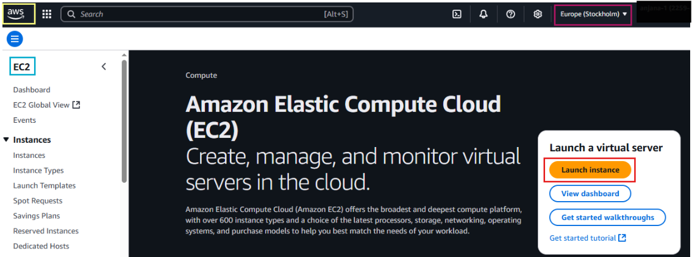  

### 1.2 Name the Instance  <br><br>

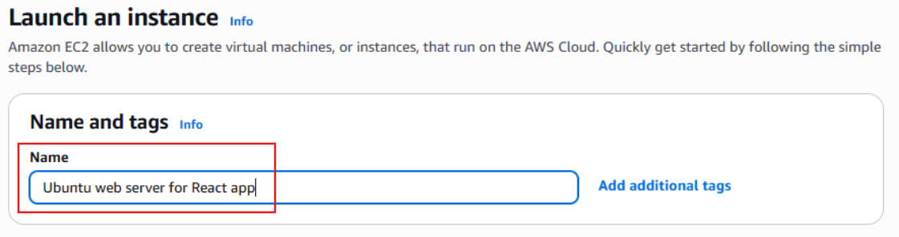  <br><br>

### 1.3 Choose OS & AMI (Ubuntu 22.04 LTS) <br><br>

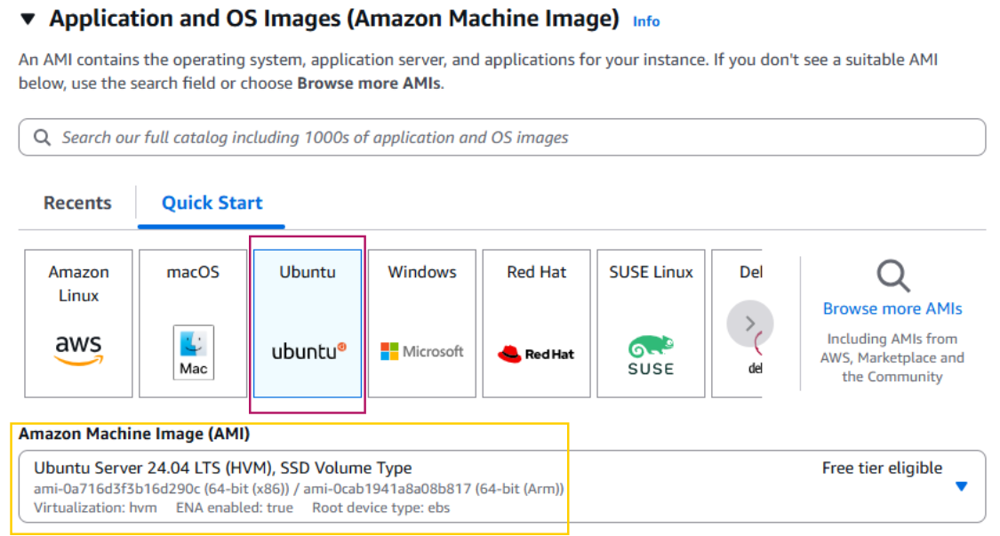  <br><br>

### 1.4 Select Instance Type  <br><br>

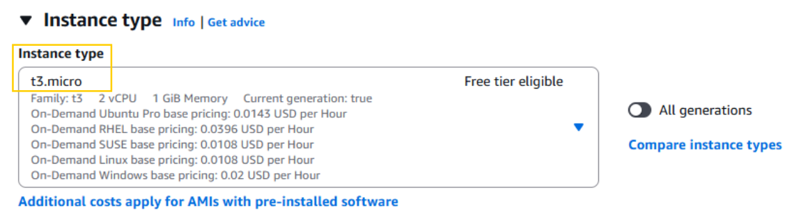  <br><br>

### 1.5 Create / Select Key Pair  <br><br>

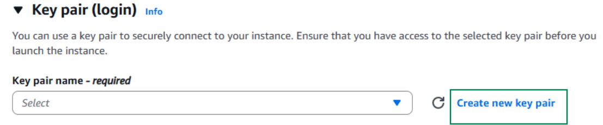  <br><br>

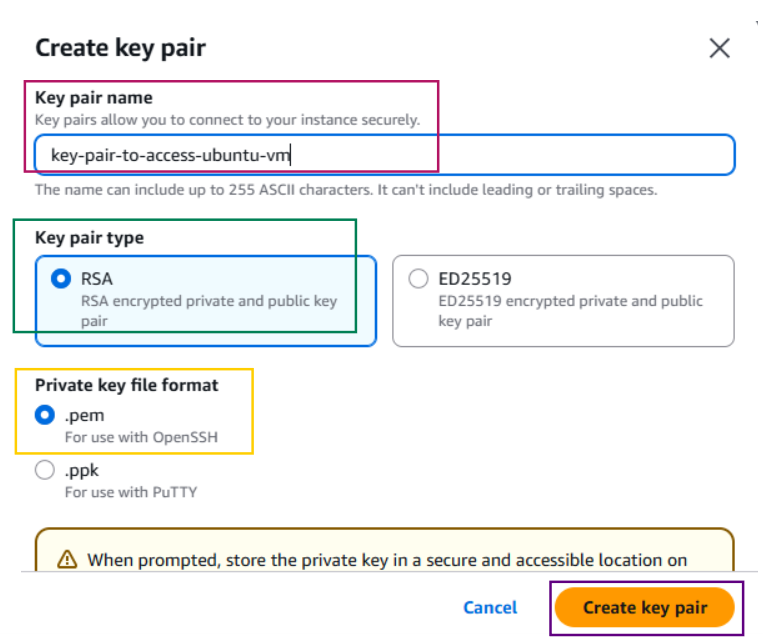 <br><br>

**Why:** Key pairs are required to securely SSH into the EC2 instance.

### 1.6 Configure Security Group  <br><br>

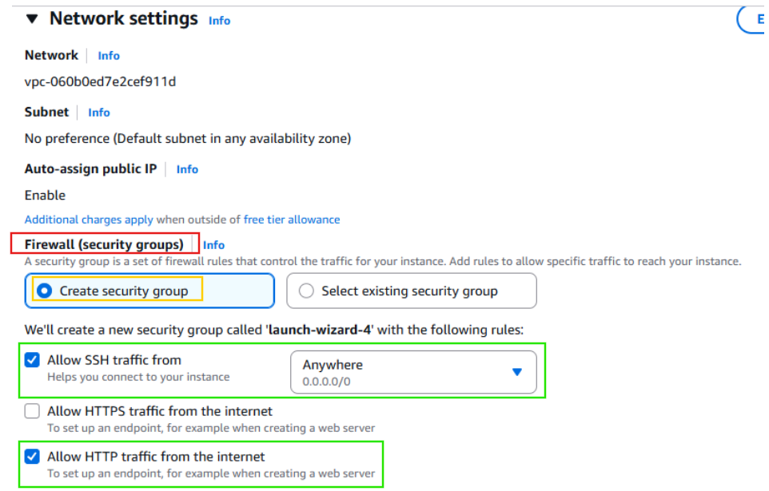  <br><br>

| Port | Purpose            |
|------|------------------|
| 22   | To access the vm remotely via SSH |
| 80   | Serve app over HTTP |

### 1.7 Review and Launch instance<br><br>

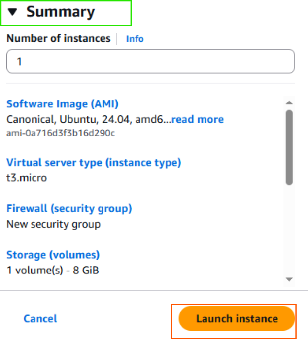 <br><br>

### 1.8 Confirm Instance is Running  <br><br>

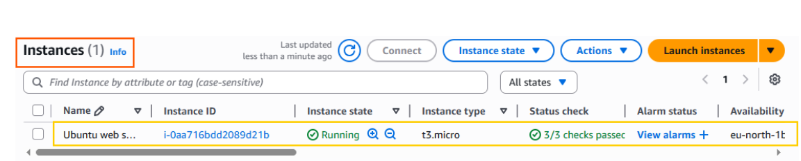 <br><br>

---

## 2. Connect to the Server

### 2.1 Navigate to Key Pair Folder  
- Open local machine terminal
- Navigate to the folder which has key pair to login to the VM <br><br>

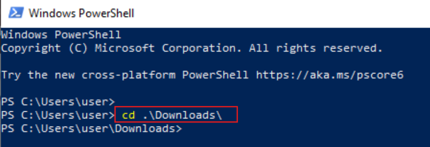 <br><br>

### 2.2 Open Instance → Connect → SSH client
### 2.3 Copy SSH Command  <br><br>

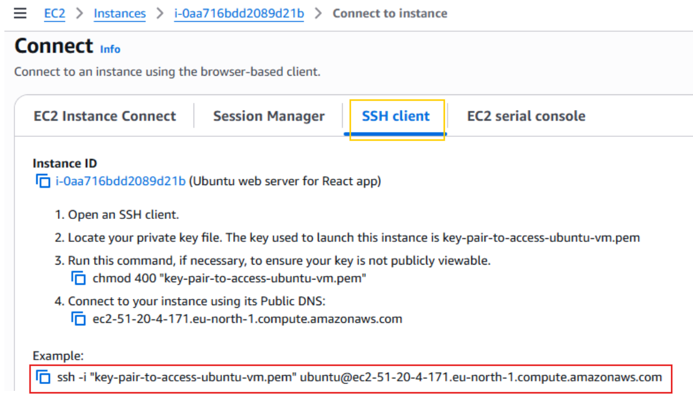 <br><br>

### 2.4 Login to EC2 via SSH

```bash
ssh -i "your-key.pem" ubuntu@<public_ip_of_vm>
ssh -i "your-key.pem" ubuntu@<public_dns_of_vm>

````
<br><br>
<br><br>

**Why:** Securely access the EC2 instance to install software and deploy the app.

---

## 3. Install Required Packages

### 3.1 Update Package Index

```bash
sudo apt update
```
<br><br>
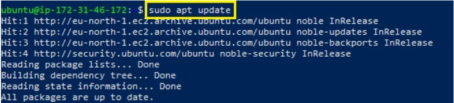<br><br>

**Why:** 
- Updates the list of available packages and versions from the repositories.
- Ensures Ubuntu installs the latest package versions when you install or upgrade software.
- Prevents errors caused by outdated package information.

### 3.2 Install Node.js & npm

```bash
sudo apt install -y nodejs npm
```
**Why:**
- Installs Node.js runtime to run JavaScript on the server.
- Installs npm to manage dependencies required by the React project.<br><br>

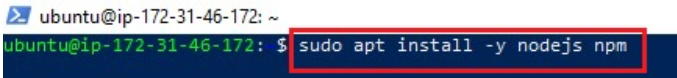<br><br>

### 3.3 Verify Installation

```bash
node -v
npm -v
```
<br><br>
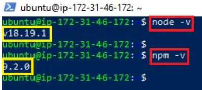<br><br>

### 3.4 Install Nginx

```bash
sudo apt install -y nginx
```
**Why:**
- Installs Nginx web server to serve your React app.
- Provides a stable, lightweight HTTP server for production use.<br><br>

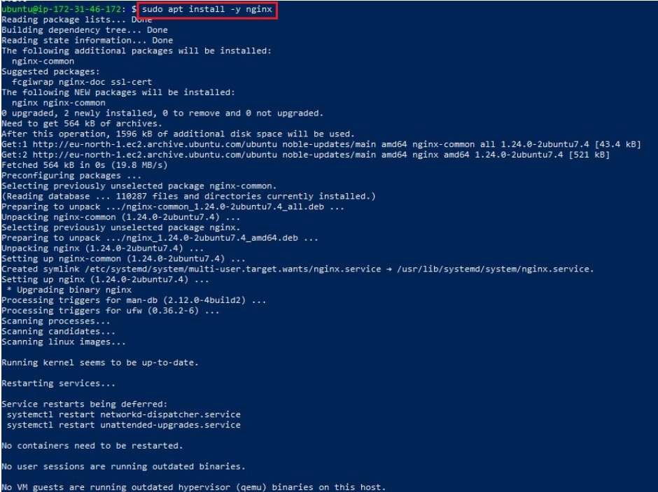<br><br>

### 3.5 Start & Enable Nginx

```bash
sudo systemctl start nginx
sudo systemctl enable nginx
sudo systemctl status nginx
```
**Why:**
- Starts Nginx immediately and sets it to auto-start on boot.
- Verifies the service is running to ensure the web server is ready to serve files.<br><br>

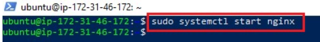<br><br>

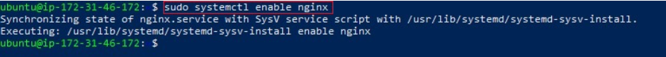<br><br>

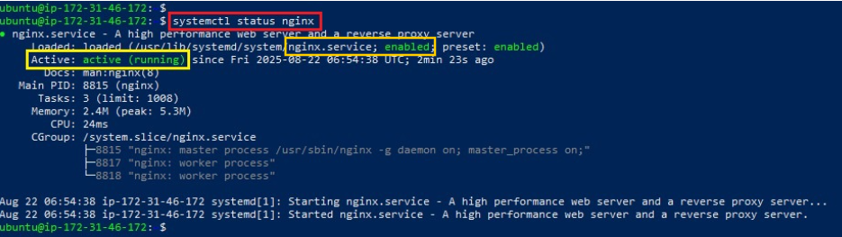<br><br>

---

## 4. Clone and Build React App

### 4.1 Clone Repository

```bash
git clone https://github.com/pravinmishraaws/my-react-app.git
```
<br><br>
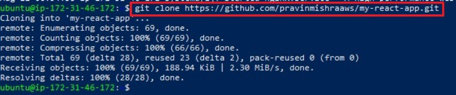<br><br>

### 4.2 Navigate to Project

```bash
cd my-react-app
```
<br><br>
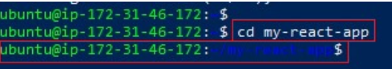<br><br>

### 4.3 Navigate to `src` Folder

```bash
cd src
```
<br><br>
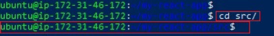<br><br>

### 4.4 Edit App.js (Optional UI Changes)

```bash
nano App.js
```
<br><br>
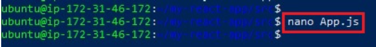<br><br>

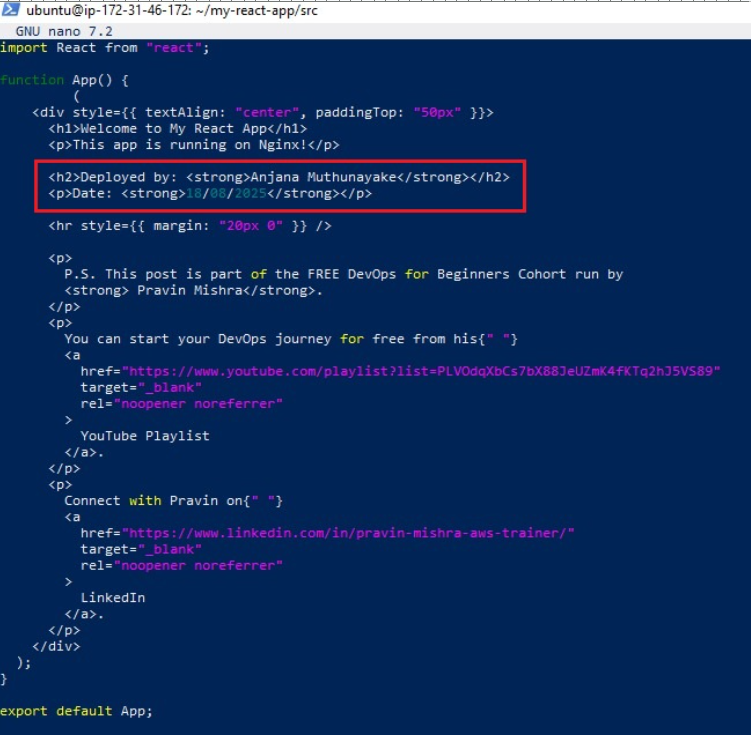<br><br>

### 4.5 Install Dependencies

```bash
npm install
```
**Why:**
- Installs all libraries and packages specified in `package.json`.
- Ensures the React project has everything it needs to build and run.
- Without this, the app might fail during the build process.

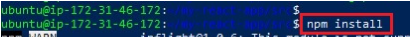<br><br>

### 4.6 Build Production Files

```bash
npm run build
```
**Why:**
- Compiles the React app into optimized production-ready static files.
- Creates a build/ folder containing HTML, CSS, JS, and assets.
- These files can be served directly by Nginx to the browser.

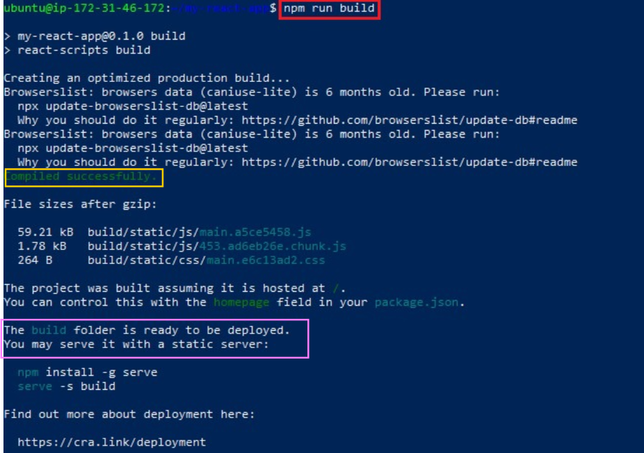<br><br>

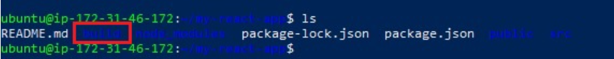<br><br>

---

## 5. Configure Nginx for App Deployment

### 5.1 Remove Default Files

```bash
sudo rm -rf /var/www/html/*
```
**Why:**
- Clears the existing files in Nginx’s default web directory.
- Prevents conflicts with the default Nginx homepage.
- Ensures your React app is the only content served.<br><br>

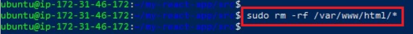<br><br>

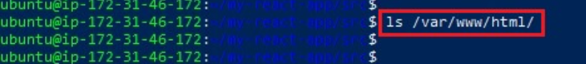<br><br>

### 5.2 Copy Build Files

```bash
sudo cp -r build/* /var/www/html/
```
**Why:**
- Moves production-ready files from the project folder to Nginx’s web directory.
- Only files in /var/www/html/ can be served by Nginx.
- Makes your React app accessible via server IP or domain.<br><br>

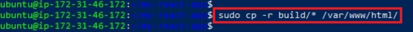<br><br>

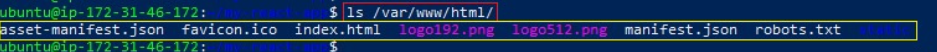<br><br>

### 5.3 Set Ownership

```bash
sudo chown -R www-data:www-data /var/www/html/
````
<br><br>
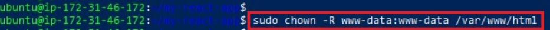<br><br>

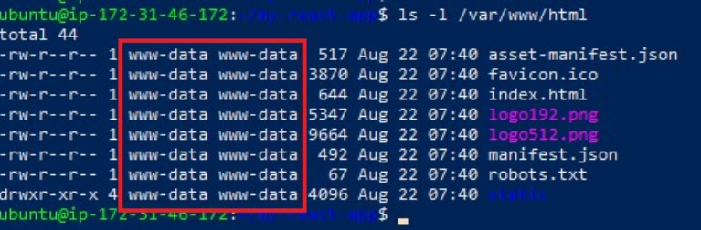<br><br>

**Why?:**

- Nginx needs correct file ownership to read and serve your React build files.
- The default Nginx user changes depending on the OS (Ubuntu = `www-data`, CentOS/Amazon Linux = `nginx`).
- Setting ownership prevents errors like **403 Forbidden** caused by incorrect permissions.
- Ensures the web server can access `/var/www/html` without restrictions.

#### **🔍 How to Check Nginx Default User (Works on Any Linux System)**

```bash
grep "user" /etc/nginx/nginx.conf
```

**Typical results:**

- Ubuntu/Debian → `user www-data;`
- CentOS/RHEL/Amazon Linux → `user nginx;`

#### **🔍 How to Check Nginx Document Root**

Because different OSes use different web root paths:

**Command:**

```bash
sudo nginx -T | grep "root"
```

**Common default locations:**

- Ubuntu/Debian → `/var/www/html`
- CentOS/RHEL → `/usr/share/nginx/html`
- Nginx (source install) → `/usr/local/nginx/html`

---

### 5.4 Set Permissions

```bash
sudo chmod -R 755 /var/www/html
```
<br><br>
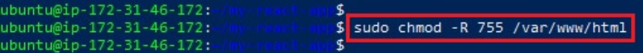<br><br>

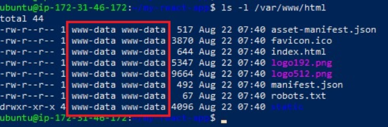<br><br>

**Why?:**

* `755` permissions allow:

  * **Owner** → read/write/execute
  * **Group & Others** → read/execute
- This ensures Nginx can read and serve the files, while still keeping them secure.
- Prevents issues where files cannot be executed or accessed by the web server.

---

### 5.5 Configure Nginx

```bash
sudo nano /etc/nginx/sites-available/default
```

Replace the default file with this **React-optimized Nginx configuration**:

```nginx
server {
  listen 80;
  server_name _;
  root /var/www/html;
  index index.html;

  location / {
    try_files $uri /index.html;
  }

  error_page 404 /index.html;
}
`<br><br>

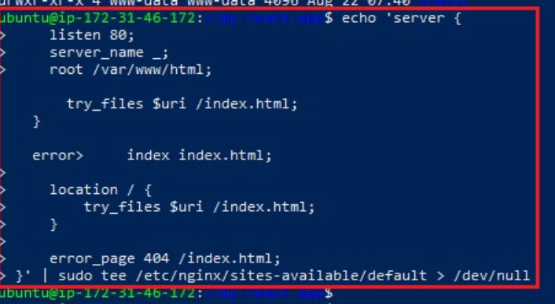<br><br>

---

#### **Why are we changing the default Nginx config?**

The default Nginx configuration on Ubuntu usually looks like this:

```nginx
root /var/www/html;
index index.nginx-debian.html;

location / {
    try_files $uri $uri/ =404;
}
```

This works for static HTML files, but **NOT** for React apps.

---

### ❗ What is an SPA?

A **Single Page Application (SPA)** means:

* The app loads **only one HTML file** → `index.html`
* All page navigation (`/login`, `/profile`, `/dashboard`) is handled **by React in the browser**
* The server **does NOT have separate HTML files** for each route

Because of this, refreshing `/profile` or `/dashboard` makes Nginx look for a real folder → **404 error**.

---

### ✔ Why This New Configuration Is Needed

#### **1. React uses client-side routing**

Routes like:

```
/dashboard
/profile
/about
```

do **not exist as files** on the server.
Nginx must always return `index.html` so React can load the correct page.

---

### ✔ How the new config fixes everything

**• `try_files $uri /index.html;`**

* If the requested file doesn’t exist
* Serve `index.html` instead
* React Router takes over and loads the page

**• `root /var/www/html;`**

* Points Nginx to the React `build/` output folder you copied earlier.

**• `error_page 404 /index.html;`**

* Ensures unknown routes still load the React app instead of showing a 404 page.

**• `listen 80;`**

* Makes the app publicly accessible on standard HTTP port.

---

### **Summary (Simple Explanation)**

This updated Nginx configuration:

* Fixes React refresh issues
* Prevents 404 errors on routes
* Replaces the default Nginx test page
* Properly serves the React `build` folder
* Ensures your app works like a real SPA

Without this change, your React app **will break** whenever someone refreshes any page.

---

### 5.6 Restart Nginx

```bash
sudo systemctl restart nginx
```
<br><br>
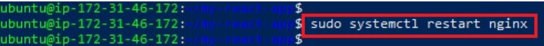<br><br>

#### **Why:**

* Applies the new Nginx configuration you edited
* Reloads routing rules required for serving the React SPA
* Ensures Nginx uses the updated files in `/var/www/html`
* Clears old cached settings and restarts with a clean state

---

## 6. Test Deployment

### 6.1 Retrieve Public IP

```bash
curl ifconfig.me
````

**Why / Explanation:**

* Retrieves the public IP address of the EC2 instance from the internet.
* **Note:** `ifconfig.me` is a website that returns the public IP of the device making the request. Using `curl` here fetches that IP so we can confirm the server’s public address.
* **Other alternatives:** You can use similar services like:

  * `curl icanhazip.com`
  * `curl checkip.amazonaws.com` (AWS-hosted, commonly used on EC2 instances)
  * `curl ipinfo.io/ip`

These commands all return the public IP of your machine in a simple, plain-text format.<br><br>

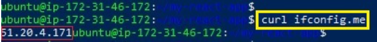<br><br>

### 6.2 Check Public IP in AWS Console
<br><br>
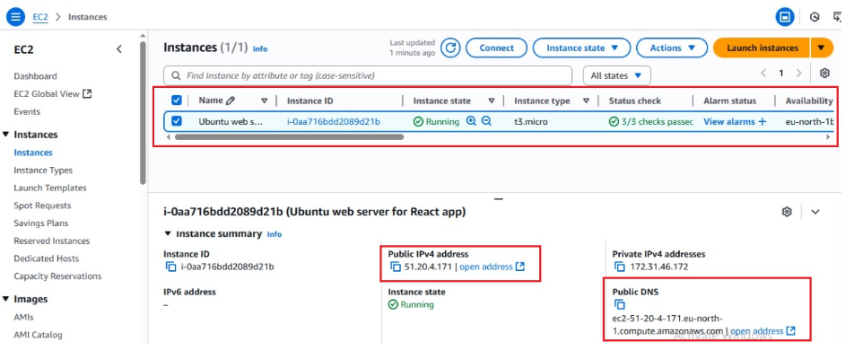<br><br>

### 6.3 Access App via Browser

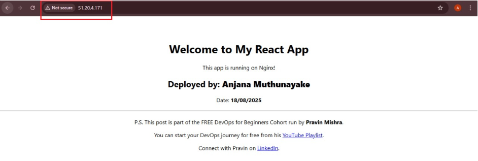<br><br>

### 6.4 Access App via Public DNS

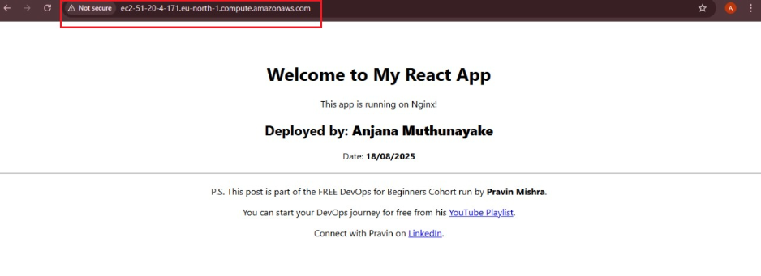
<br><br>
### 6.5 Verify Using curl

```bash
curl http://<public-ip>
````

**Why / Explanation:**

* Sends an HTTP request to your server’s public IP.
* Returns the HTML content served by Nginx, which should be the `index.html` of your React app.
* Useful to quickly verify that the React app is deployed and accessible without opening a browser.<br><br>

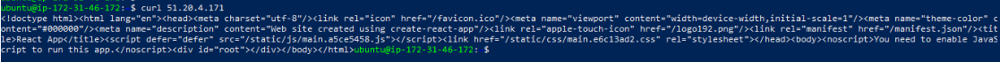<br><br>

---

## ✅ Deployment Completed

Your React application is now live on the internet using **AWS EC2 + Ubuntu + Nginx**. 🎉

