# **Assignment 4 – Linux Administration Practice**

(DevOps Micro Internship – Week 1)

This assignment focuses on **post-deployment Linux administration tasks** on your Ubuntu VM where your React app is running using Nginx.
It includes networking, process monitoring, and system information commands — all essential for real-world DevOps troubleshooting.
<br><br>
---

## *📌 Task 1 – Networking Commands**

## **1. Check Network Interface Configuration**

**Note:** `ifconfig` is part of the `net-tools` package. On modern Ubuntu, it may not be installed by default. <br><br>

### **Install net-tools (if not already installed)**

```bash
sudo apt install net-tools
````
<br><br>

**Reason:** This installs `ifconfig` and other networking utilities, allowing you to check network interface details.<br><br>

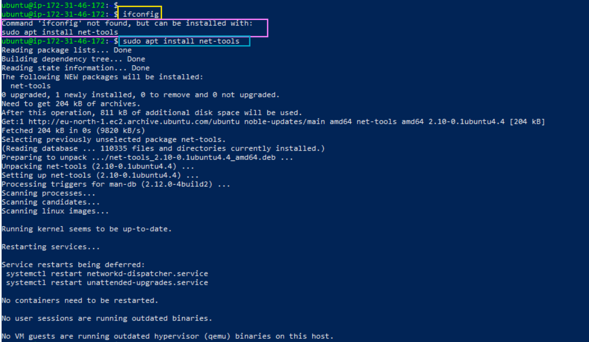<br><br>

---

### **Run ifconfig**

```bash
ifconfig
```
<br>

### **Command Breakdown**<br><br>

| Part       | Meaning       |
| ---------- | ------------- |
| **if**     | interface     |
| **config** | configuration |

<br>
**Full Meaning:**
"Show the configuration of all network interfaces."<br><br>

### **Explanation**

This command displays IP addresses, MAC addresses, and interface status.
It’s useful for checking network connectivity, verifying your server’s IP setup, and troubleshooting networking issues.<br><br>

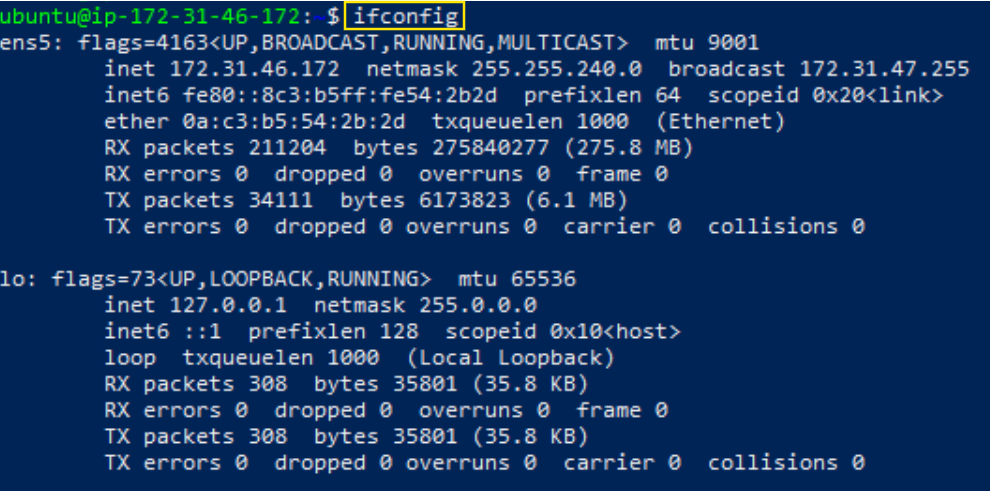<br><br>

---

## **2. Test Connectivity to a Domain**

```bash
ping -c 4 thecloudadvisory.com
```
<br>

### **Command Breakdown**

| Part                     | Meaning                                     |
| ------------------------ | ------------------------------------------- |
| **ping**                 | Packet Internet Groper (sends test packets) |
| **-c 4**                 | send exactly 4 packets                      |
| **thecloudadvisory.com** | target domain                               |

<br>
**Full Meaning:**
"Send 4 ICMP packets to thecloudadvisory.com and measure response time."<br>

### **Explanation**

This checks whether your server can reach the target website and confirms internet + DNS connectivity.<br><br>

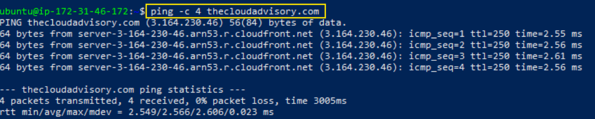
<br><br>
---

## **3. Check Open Ports & Listening Services**

```bash
sudo netstat -tulnp
```
<br>

### **Command Breakdown**

| Flag        | Meaning                     |
| ----------- | --------------------------- |
| **sudo**    | run with admin privileges   |
| **netstat** | network statistics          |
| **-t**      | show TCP ports              |
| **-u**      | show UDP ports              |
| **-l**      | show listening ports only   |
| **-n**      | show numeric output         |
| **-p**      | show process using the port |

<br>
**Full Meaning:**
"List all TCP/UDP listening ports and the processes behind them."<br><br>

### **Explanation**

This helps verify whether services like Nginx (port 80) or SSH (port 22) are running properly.<br><br>

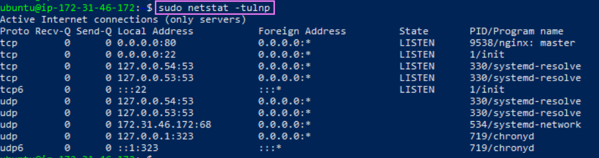<br><br>
---

## **4. DNS Lookup (Method 1 – dig)**

```bash
dig pravinmishra.in
```
<br>

### **Command Breakdown**

| Part                | Meaning                   |
| ------------------- | ------------------------- |
| **dig**             | Domain Information Groper |
| **pravinmishra.in** | domain to query           |

<br>
### **Explanation**

`dig` shows DNS records such as A record, nameservers, and TTL. It helps validate DNS configuration.<br><br>

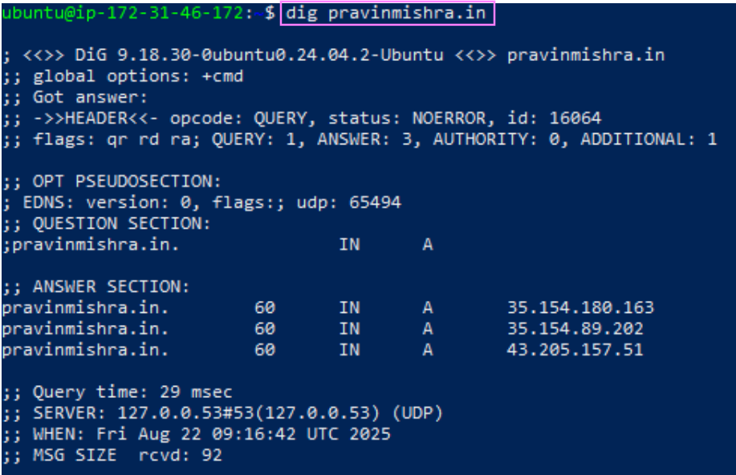<br><br>

---

## **5. DNS Lookup (Method 2 – host)**

```bash
host pravinmishra.in
```
<br>

### **Command Breakdown**

* **host** → quick DNS lookup tool

### **Explanation**

This provides a simpler DNS lookup showing only key records like A/AAAA. It’s faster and used for quick checks.<br><br>

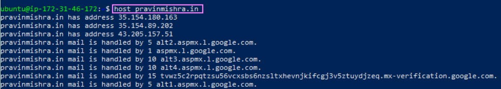<br><br>

---

## **6. Download a File with wget**

```bash
wget -O /tmp/Untitled-design-40.png <URL>
```
<br>

### **Command Breakdown**

| Part         | Meaning                 |
| ------------ | ----------------------- |
| **wget**     | download file via web   |
| **-O**       | specify output filename |
| **/tmp/...** | save location           |

<br>
### **Explanation**

Used to download images, scripts, or configuration files to the server — very useful in automated deployments.<br><br>

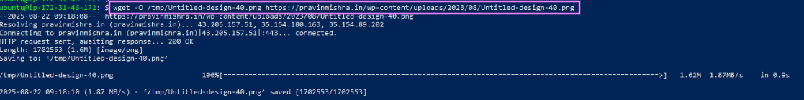<br><br>

---

## **📌 Task 2 – Process Monitoring & Control**

## **Understanding Processes & Services**

Before performing process monitoring, here’s a quick guide to clarify key concepts:

* **Process:** A program that is currently executing on the computer.

  * Programs exist on disk; they become processes only when executed.
  * While running, a process consumes resources such as CPU and memory.
  * When execution finishes, the process terminates (normally) or is killed (forcefully).
  * Typically started by a **user** and often require manual interaction.
  * Examples: Opening a browser, VS Code, or running a command like `ping`.

* **Service:** A special type of process that usually runs in the **background** (daemon).

  * Often started automatically by the OS at boot.
  * Managed by the system, not by manual user interaction.
  * Continues running even if no user is logged in.
  * Can be stopped, started, or restarted using service management commands.
  * If a service is not enabled, it stops when the machine shuts down.

* **Daemon:** A background process that runs independently of user sessions. Most services are daemons. Unlike normal programs, daemons usually don’t have a visible interface.

> ✅ **Summary:** Programs become processes when executed by a user. Some processes run in the background as services/daemons, which are managed by the system and provide continuous functionality.

> ⚠ **Note:** Commands like `ps`, `pstree`, and `kill` mostly show **user-started processes**, but they can also display system services if you have sufficient permissions. Stopping a user process affects only that task, whereas stopping a system service may impact other dependent processes.<br><br>

---

## **7. List All Running Processes**

```bash
ps -e
```
<br>

### **Command Breakdown**

| Part   | Meaning            |
| ------ | ------------------ |
| **ps** | process status     |
| **-e** | show all processes |

<br>
### **Explanation**

Displays all running processes on the machine. Useful for identifying what is currently running, whether user-started programs or system services.<br><br>

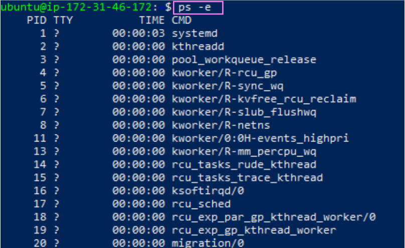<br><br>

---

## **8. Search for Nginx Process**

```bash
ps aux | grep nginx
```
<br>

### **Command Breakdown**

| Part           | Meaning                              |
| -------------- | ------------------------------------ |
| **ps aux**     | show all processes with full details |
| **|**          | pipe output                          |
| **grep nginx** | search for text “nginx”              |

<br>
### **Explanation**

Checks whether the Nginx process is active. Shows PID, memory/CPU usage, and other details of processes matching “nginx”.<br><br>

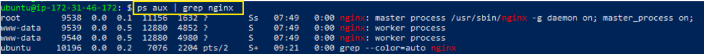<br><br>

---

## **9. View Process Hierarchy**

```bash
pstree
```
<br>

### **Command Breakdown**

| Part     | Meaning                             |
| -------- | ----------------------------------- |
| **ps**   | process                             |
| **tree** | display in hierarchical tree format |

<br>
### **Explanation**

Shows parent–child relationships between processes. Useful when analyzing service dependencies or understanding which processes spawned others.<br><br>

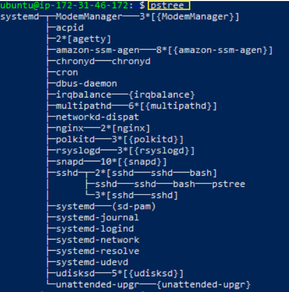<br><br>

---

## **10. Terminate a Process**

```bash
kill <PID>
```
<br>

### **Command Breakdown**

| Part     | Meaning                   |
| -------- | ------------------------- |
| **kill** | send signals to a process |
| **PID**  | process ID to terminate   |

<br>
### **Explanation**

Stops a running process. Useful for closing unresponsive or unnecessary tasks. Note: terminating a user process is different from stopping a service; services are managed by the system and may restart automatically.<br><br>

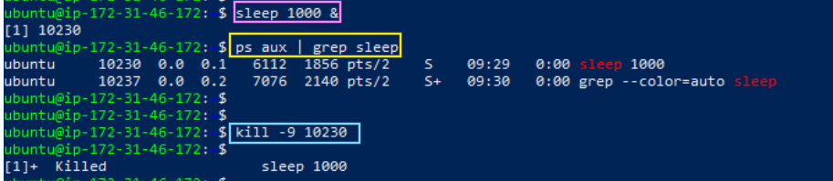<br><br>

---

## *📌 Task 3 – System Information Commands**

---

## **11. Display Full System Info**

```bash
uname -a
```
<br>

### **Command Breakdown**

| Flag   | Meaning          |
| ------ | ---------------- |
| **-a** | show all details |

<br>
### **Explanation**

Displays kernel version, OS type, architecture — helpful for debugging OS issues.<br><br>

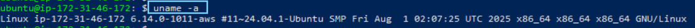<br><br>
---

## **12. Check System Uptime**

```bash
uptime
```
<br>

### **Explanation**

Shows how long the system has been running and its load average — useful for performance monitoring.<br><br>

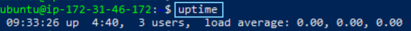<br><br>

---

## **13. Display Logged-in Users**

```bash
who
```
<br>

### **Explanation**

Shows active logged-in users. Helps identify unauthorized access or user sessions.<br><br>

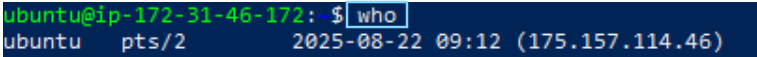<br><br>

---

## **14. Check Memory Usage**

```bash
free -h
```
<br>

### **Command Breakdown**

* **-h** → human-readable format

### **Explanation**

Displays total, used, and free memory in readable units. Helpful for detecting memory bottlenecks.<br><br>

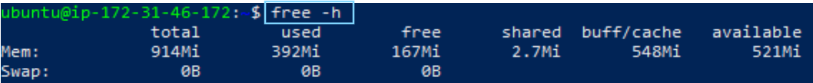<br><br>

---

## **15. Check Disk Usage**

```bash
df -h
```
<br>

### **Command Breakdown**

* **df** → disk filesystem
* **-h** → human-readable format

### **Explanation**

Shows available disk space on mounted filesystems. Important for preventing “disk full” errors.<br><br>

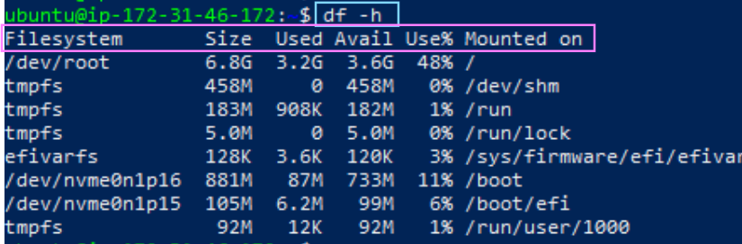<br><br>

---

## **16. Directory Size in /var**

```bash
sudo du -sh /var/*
```
<br>

### **Command Breakdown**

| Part      | Meaning           |
| --------- | ----------------- |
| **du**    | disk usage        |
| **-s**    | summary only      |
| **-h**    | human-readable    |
| **/var/** | directory to scan |
| **/*`**   | all files and directories inside the selected directory |

<br>
### **Explanation**

Shows which directories inside `/var` are consuming the most space — useful for identifying log or cache bloat.<br><br>

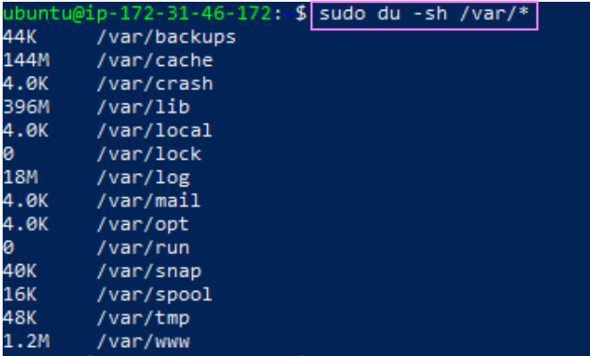<br><br>

---


