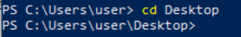
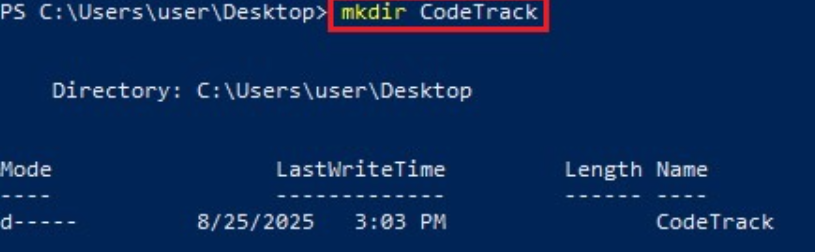
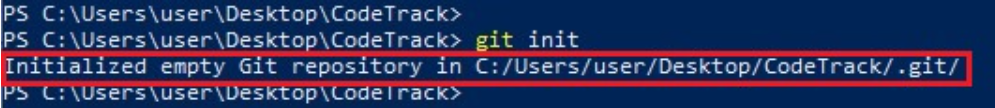
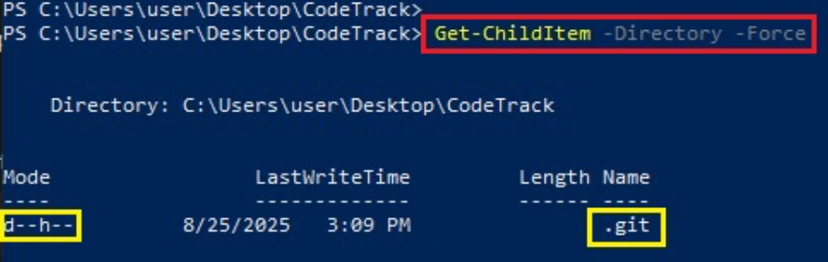
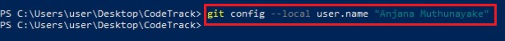
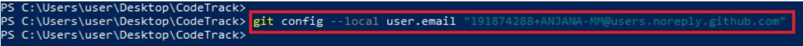
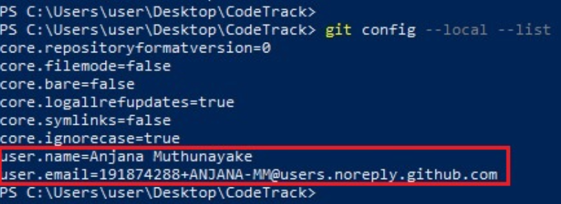
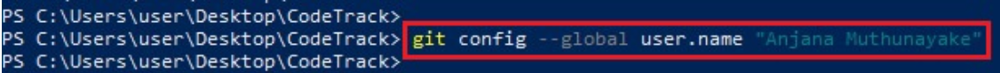
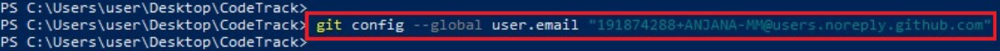
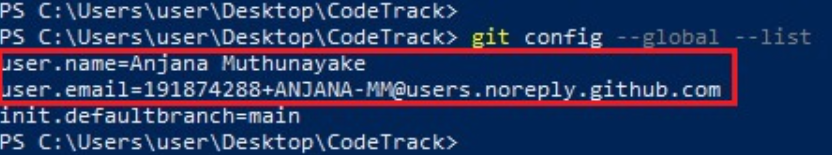

# Assignment 5 – CodeTrack: Initial Git Setup (Local Only)

## Objective
Set up Git on a local machine by initializing a repository and configuring Git username and email both **locally (per project)** and **globally (system-wide)**, following professional DevOps practices.

---

## Prerequisites

* Git installed (Git Bash on Windows or Terminal on macOS/Linux)
* Basic terminal navigation knowledge

---

## Task 1 – Create a Local Project Directory

**Goal:**  
Simulate creating a new local project directory for the CodeTrack application.

**Steps Performed:**

1. Navigated to a preferred working directory (Desktop/Documents)  
   ```bash
   cd ~/Desktop   # macOS/Linux
   cd C:\Users\YourName\Desktop   # Windows
````


*Figure 2 – Navigate to Desktop*

2. Created a folder named `CodeTrack`

   ```bash
   mkdir CodeTrack   # macOS/Linux/Windows
   cd CodeTrack
   ```

   
   *Figure 3 – Create CodeTrack Folder*

3. Initialized a local Git repository using `git init`

   ```bash
   git init
   ```

   
   *Figure 5 – Initialize Git repository*

4. Verified the creation of the hidden `.git` directory

   ```bash
   ls -a        # macOS/Linux
   dir /a       # Windows
   ```

   
   *Figure 6 – .git folder verification*

**Expected Output:**

Initialized empty Git repository in .../CodeTrack/.git/

---

## Task 2 – Configure Git Locally for CodeTrack

**Goal:**  
Configure Git identity **only for this repository**, which is recommended for team/enterprise scenarios when identities differ by project.

**Commands and Steps:**

1. Configure username locally:

```bash
git config --local user.name "Your Name"
````


*Figure 7 – Config username locally*

2. Configure email locally:

```bash
git config --local user.email "your.email@example.com"
```


*Figure 8 – Config user email locally*

3. Verify local configuration:

```bash
git config --local --list
```


*Figure 9 – Git local config verification*

---

**Expected Output:**

```
user.name=Your Name
user.email=your.email@example.com
```

**Note:**
For GitHub usage, consider using a noreply email to keep your personal email private:
`12345678+username@users.noreply.github.com`

---

## Task 3 – Configure Git Globally (Optional but Recommended)

**Goal:**  
Set a default Git identity for all repositories on the local machine. This is useful for personal projects and serves as a fallback when no local configuration is defined.

---

**Commands and Steps:**

1. Configure username globally:
```bash
git config --global user.name "Your Name"
````


*Figure 10 – Config username globally*

2. Configure email globally:

```bash
git config --global user.email "your.email@example.com"
```


*Figure 11 – Config user email globally*

3. Verify global configuration:

```bash
git config --global --list
```


*Figure 12 – Git global config verification*

---

**Expected Output:**

```
user.name=Your Name
user.email=your.email@example.com
```

**Note:**
Take a screenshot of `git config --global --list` for assignment submission.

---

## Local vs Global Git Configuration

| Scope      | Usage                                                                    |
| ---------- | ------------------------------------------------------------------------ |
| **Global** | Default identity across all personal projects                            |
| **Local**  | Overrides identity per repository (useful for work vs personal projects) |


---

## Skills Gained

* Initializing a Git repository from scratch
* Understanding Git repository structure (`.git` directory)
* Configuring Git identity at local and global levels
* Applying Git best practices for enterprise/team projects
* Preparing a clean Git environment before pushing code to GitHub

---
