# Assignment 6 – Tracking and Staging Changes in a CodeTrack Project

## Objective

Reinforce basic Git commands by creating and tracking files, staging changes, committing updates, verifying repository status, and deploying a simple HTML/CSS application on an **AWS EC2 instance using Nginx**.

---

## Prerequisites

* Git installed and configured
* CodeTrack project directory created (Assignment 5)
* Basic knowledge of terminal commands
* AWS EC2 instance (Amazon Linux)

---

## Task 1 – Ensure Git Setup

**Goal:** Verify that Git is installed and properly configured before tracking files.

**Steps Performed:**

```bash
git --version
git config --list
```

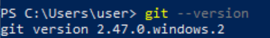 <br>
*Figure 13 – Git installation verification*

---

## Task 2 – Navigate to Project Folder

**Goal:** Move into the existing `CodeTrack` project directory.

**Steps Performed:**

**Windows (Command Prompt):**

```bash
cd path\to\CodeTrack
```

**macOS / Linux:**

```bash
cd ~/path/to/CodeTrack
```

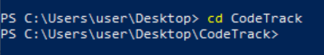 <br>
*Figure 14 – Navigate to project folder*

Confirmed present working directory:

```bash
pwd
```

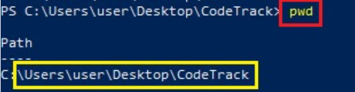 <br>
*Figure 15 – Confirm present working directory*

---

## Task 3 – Create and Modify Files

**Goal:** Create project files and populate them with content.

**Steps Performed:**

1. Created `index.html` and `style.css` files:

```bash
touch index.html style.css        # macOS/Linux
```

> **Windows Note:** Files were created manually or using VS Code.

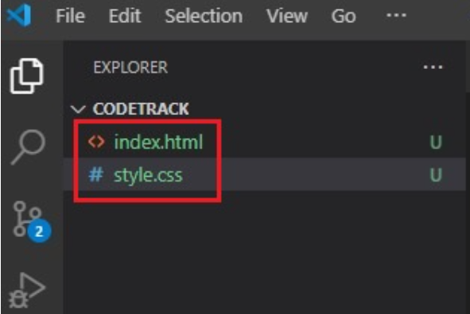 <br>
*Figure 17 – Create index.html & style.css*

2. Verified files were created:

```bash
ls
```

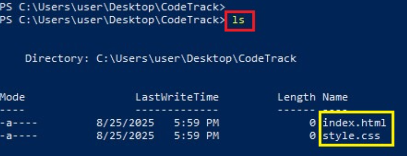 <br>
*Figure 18 – Verification of created files*

3. Copied content from the GitHub repository:

[`Week-2---Git-GitHub-Assignment`](https://github.com/pravinmishraaws/Week-2---Git-GitHub-Assignment) and pasted it into local files.

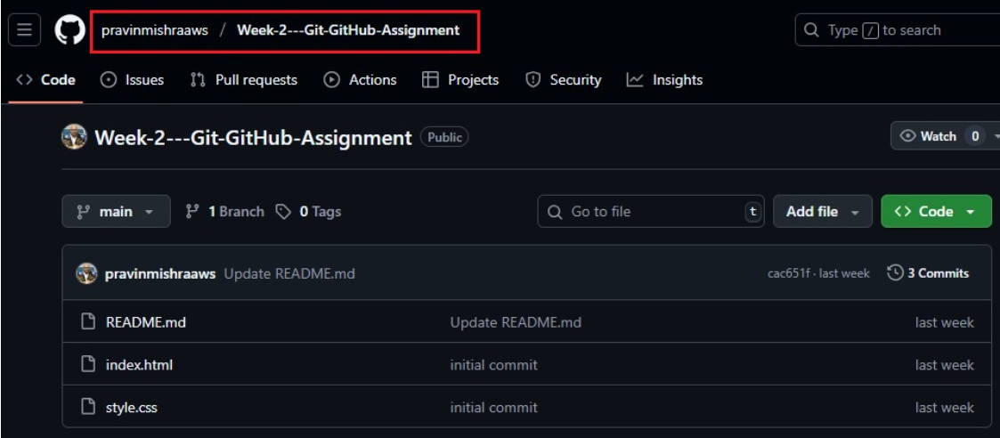 <br>
*Figure 19 – GitHub repository*

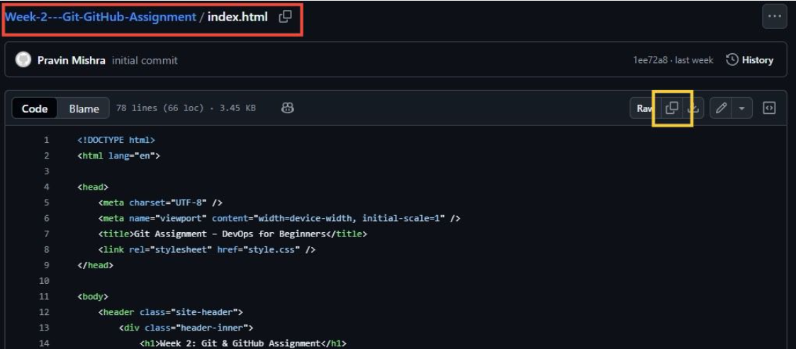 <br>
*Figure 20 – Copy index.html content*

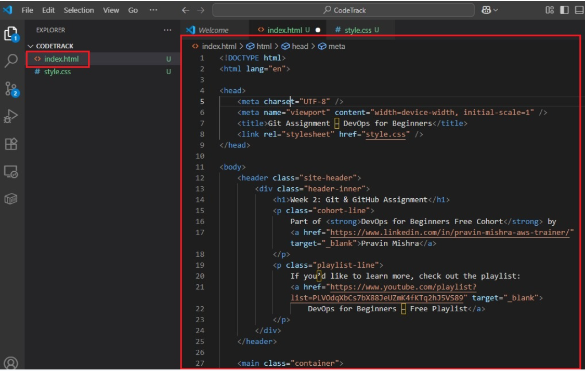 <br>
*Figure 21 – Paste index.html content*

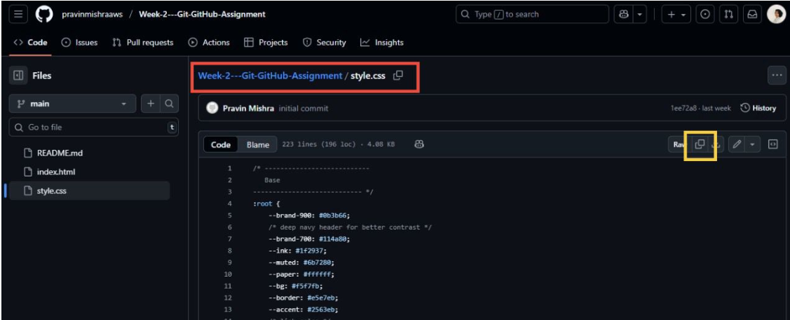 <br>
*Figure 22 – Copy style.css content*

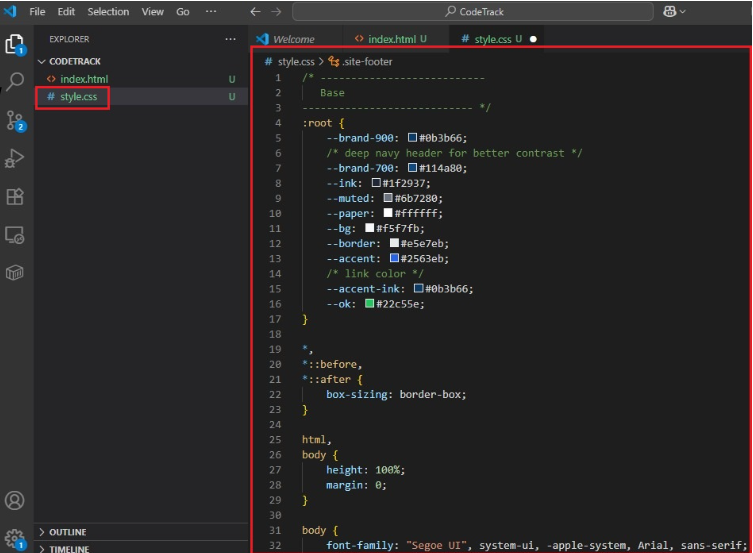 <br>
*Figure 23 – Paste style.css content*

---

## Task 4 – Track Files Using Git

**Goal:** Track newly created files using Git.

**Steps Performed:**

```bash
git status
```

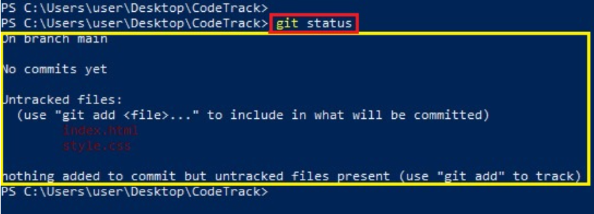 <br>
*Figure 24 – git status output*

```bash
git add .
```

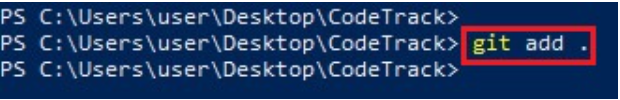 <br>
*Figure 25 – git add command*

```bash
git status
```

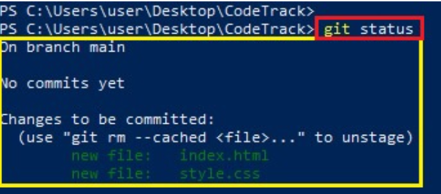 <br>
*Figure 26 – Files staged for commit*

---

## Task 5 – Commit the Changes

**Goal:** Commit staged files with a meaningful commit message.

**Steps Performed:**

```bash
git commit -m "Initial commit - Added index.html and style.css"
```

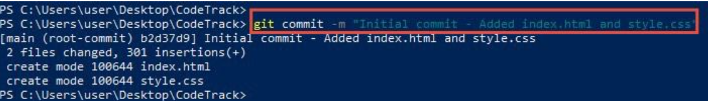 <br>
*Figure 27 – Initial commit*

```bash
git log --oneline
```

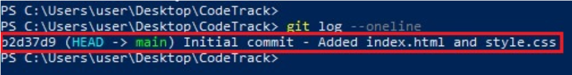 <br>
*Figure 28 – Commit history*

---

## Task 6 – Modify a File and Commit Again

**Goal:** Understand how Git tracks modified files.

**Steps Performed:**

1. Opened `index.html` in a browser and followed the instructions inside the file.

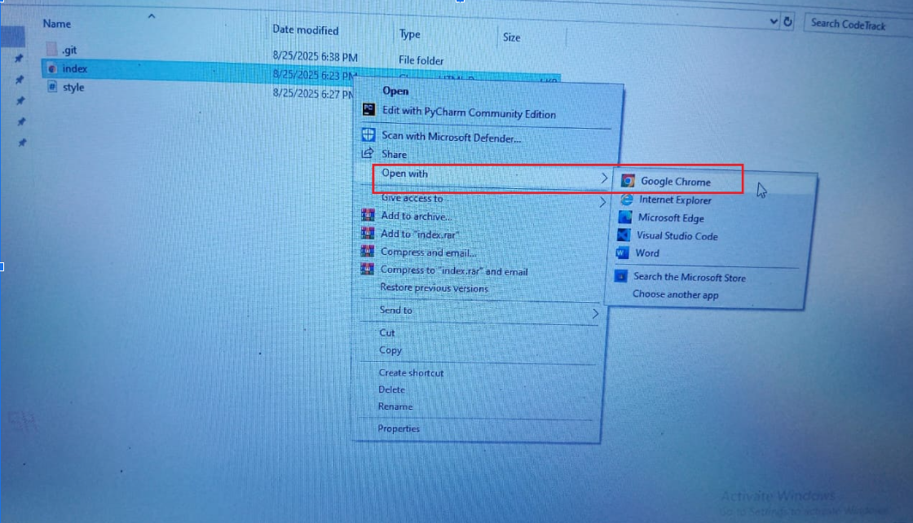 <br>
*Figure 29 – Opening index.html in the browser*

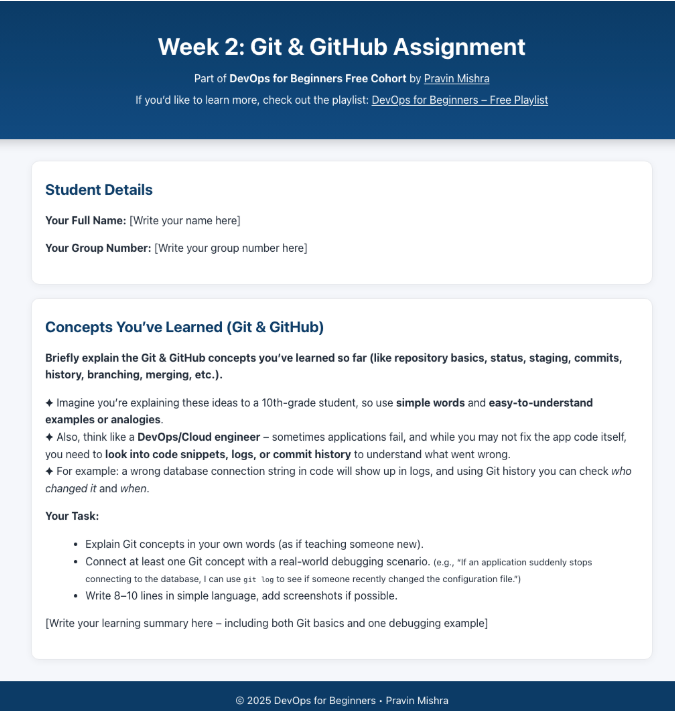 <br>
*Figure 30 – Instructions shown inside index.html*

2. Opened the project in Visual Studio Code and updated `index.html` and `style.css` as instructed.

3. Checked file status:

```bash
git status
```

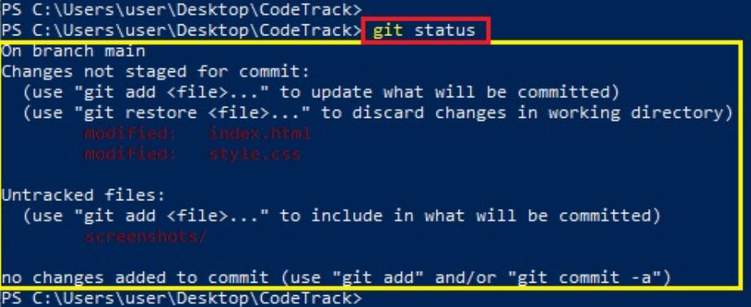 <br>
*Figure 41 – Modified files*

4. Staged and committed the modified files:

```bash
git add .
```

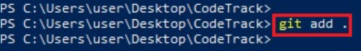 <br>
*Figure 45 – Files added to the staging area using git add .*

```bash
git status
```

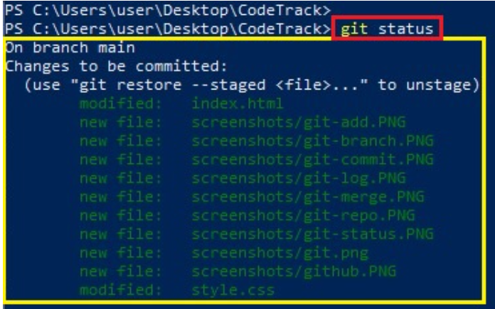 <br>
*Figure 46 – Git status showing files staged for commit*

```bash
git commit -m "Updated index.html and style.css"
```

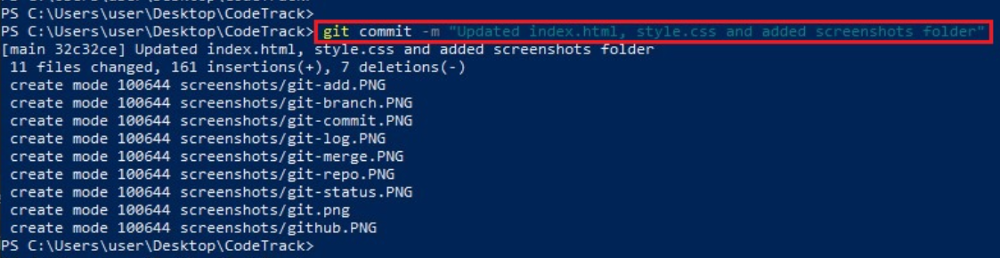 <br>
*Figure 47 – Committed changes with a descriptive message*

```bash
git log --oneline
```

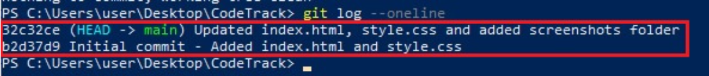 <br>
*Figure 48 – Updated commit history using git log --oneline*

---

## Task 7 – Deploy Application on AWS EC2

**Goal:** Deploy the CodeTrack application on an EC2 instance using Nginx (as performed in the Linux section).

---

### **1. Launched an EC2 Instance**

Configured the EC2 instance with the following **security group rules**:

* **HTTP (Port 80)**: Allowed from **Anywhere (0.0.0.0/0)** to access the application via a browser.
* **SSH (Port 22)**: Allowed from the user's IP address to securely connect to the EC2 instance remotely.

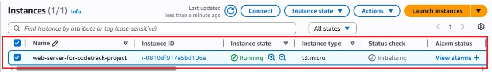 <br>
*Figure 46 – Launch EC2 instance*

---

### **2. Connected to the EC2 Instance**

Connected to the EC2 instance using SSH:

```bash
ssh -i your-key.pem ec2-user@<EC2-Public-IP>
```

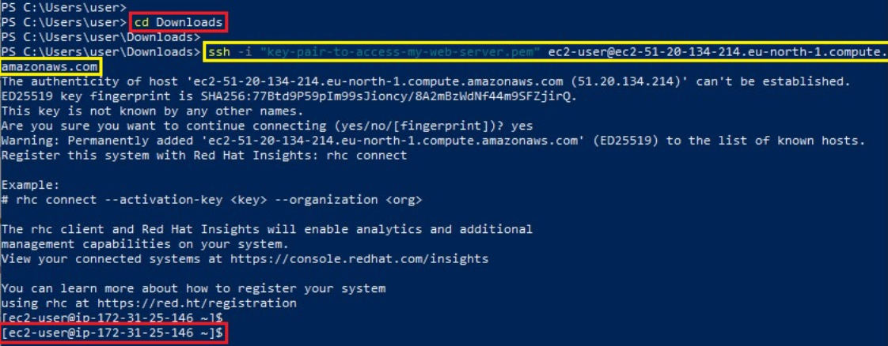 <br>
*Figure 47 – Connect to EC2 instance*

---

### **3. Updated System Packages**

```bash
sudo yum update -y
```

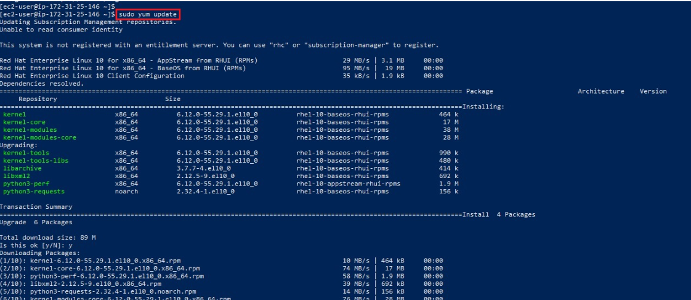 <br>
*Figure 48 – Update packages*

---

### **4. Installed Nginx**

```bash
sudo yum install nginx -y
```

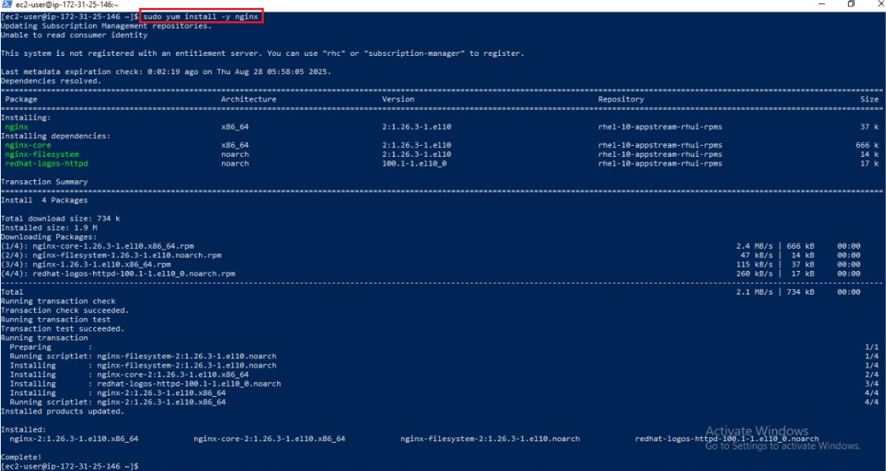 <br>
*Figure 49 – Install Nginx*

---

### **5. Started and Enabled Nginx Service**

```bash
sudo systemctl start nginx
sudo systemctl enable nginx
sudo systemctl status nginx
```

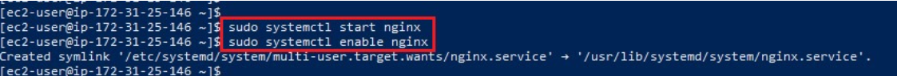 <br>
*Figure 50 – Start and enable Nginx*

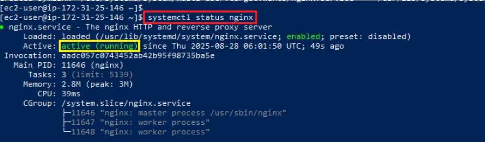 <br>
*Figure 51 – Check Nginx status*

---

### **6. Deployed Application Files**

Copied files from the local machine to the EC2 instance’s home folder:

```bash
scp -i your-key.pem -r CodeTrack ec2-user@<EC2-Public-IP>:/home/ec2-user/
```

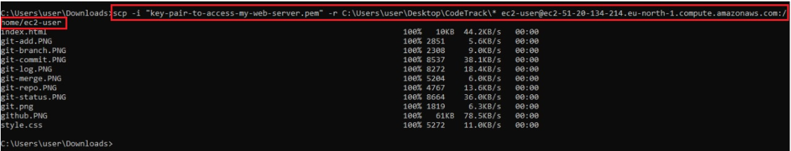 <br>
*Figure 52 – Copied local project folder to the EC2 instance’s home directory*

Removed existing files to avoid conflicts:

```bash
sudo rm -rf /usr/share/nginx/html/*
```

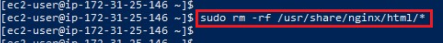 <br>
*Figure 53 – Remove existing files*

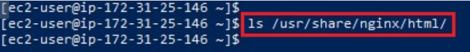 <br>
*Figure 54 – Verify existing files were removed*

Copied application files to the Nginx directory:

```bash
sudo cp -r /home/ec2-user/CodeTrack/* /usr/share/nginx/html/
```

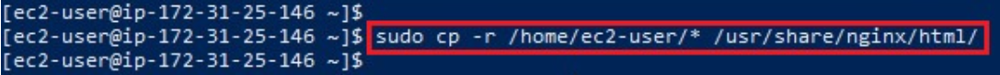 <br>
*Figure 55 – Copy website files to Nginx directory*

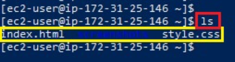 <br>
*Figure 56 – Verify files were copied*

---

### **7. Updated Ownership**

```bash
sudo chown -R nginx:nginx /usr/share/nginx/html/
```

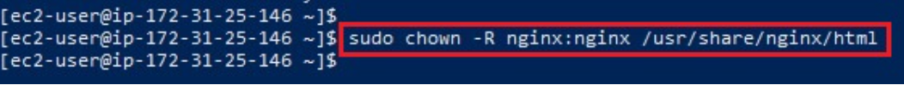 <br>
*Figure 57 – Change ownership*

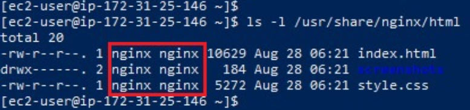 <br>
*Figure 58 – Verify ownership change*

---

### **8. Set Permissions**

```bash
sudo chmod -R 755 /usr/share/nginx/html/
```

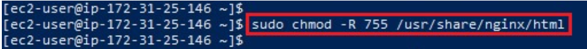 <br>
*Figure 59 – Set permissions*

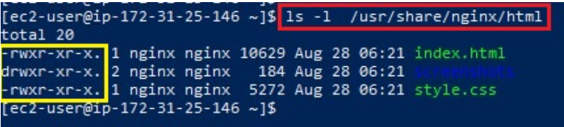 <br>
*Figure 60 – Verify permissions*

---

### **9. Accessed the Application**

Accessed the application via:

```
http://<EC2-Public-DNS>
```

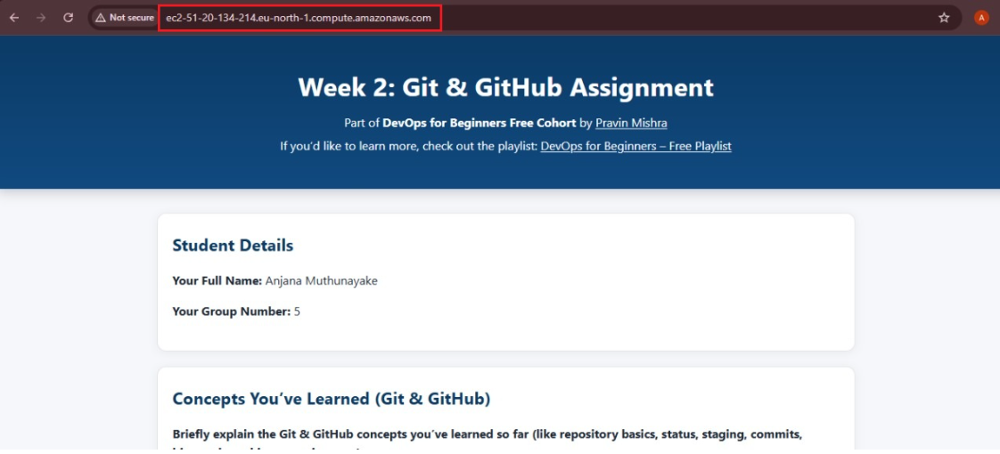 <br>
*Figure 61 – Access application using public DNS*

```
http://<EC2-Public-IP>
```

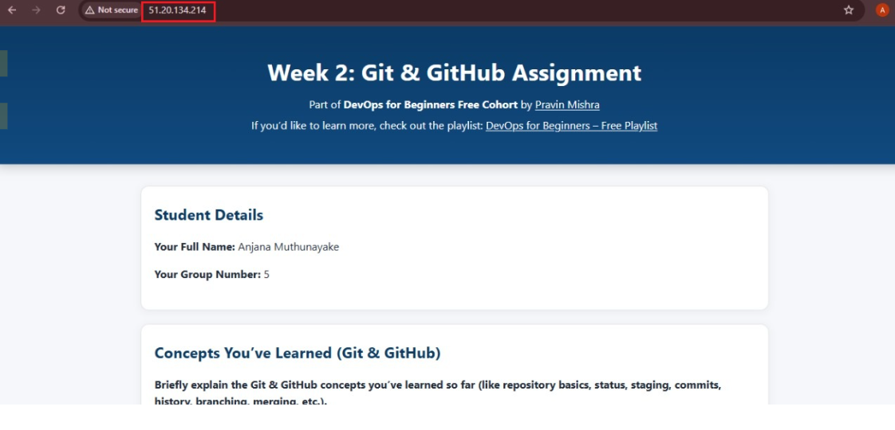 <br>
*Figure 62 – Application running successfully*

---

## Skills Gained

* Deploying static applications on AWS EC2
* Installing and managing Nginx
* Linux package management
* File ownership and permissions
* End-to-end deployment workflow

---
