# Assignment 7 – Branching Workflow: Add & Verify a Contact Page

## Objective

Practice Git branching workflow by creating a **feature branch**, adding a new page (`contact.html`), committing changes, merging into **main**, and verifying functionality in a browser.

---

## Step 0 – Start from Existing Repository

**Goal:**
Ensure you are starting from the main branch of the existing CodeTrack project and confirm repository status.

**Steps Performed:**

1. Navigate to the CodeTrack project folder:

```bash
cd path/to/CodeTrack
```

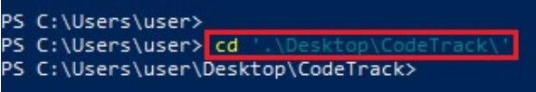 <br>
*Figure 63 – Navigate to project folder*

2. Check repository status and current branch:

```bash
git status
git branch
```

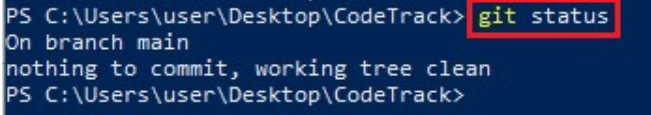 <br>
*Figure 64 – Git status output*

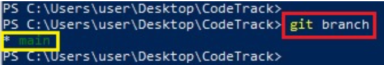 <br>
*Figure 65 – Current branch*

**Expected Output:**
Repository should be on `main` branch with no uncommitted changes.

---

## Step 1 – Create and Switch to Feature Branch

**Goal:**
Isolate development of the Contact Page in a separate branch.

**Steps Performed:**

1. Create and switch to `feature/contact-page` branch:

```bash
git checkout -b feature/contact-page
```

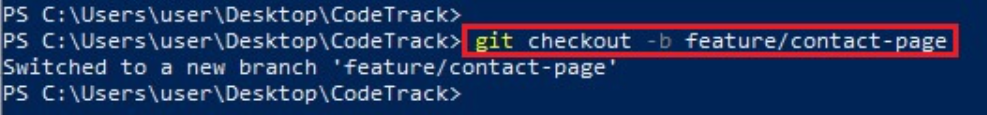 <br>
*Figure 66 – Feature branch created*

2. Verify the current branch:

```bash
git branch
```

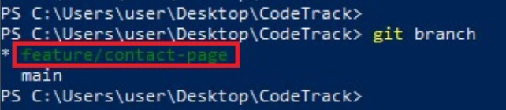 <br>
*Figure 67 – Current branch shows feature/contact-page*

---

## Step 2 – Add `contact.html` in Feature Branch

**Goal:**
Add a new page (`contact.html`) without affecting main branch.

**Steps Performed:**

1. Create `contact.html`:

```bash
# macOS/Linux
touch contact.html

# Windows PowerShell
ni contact.html
```

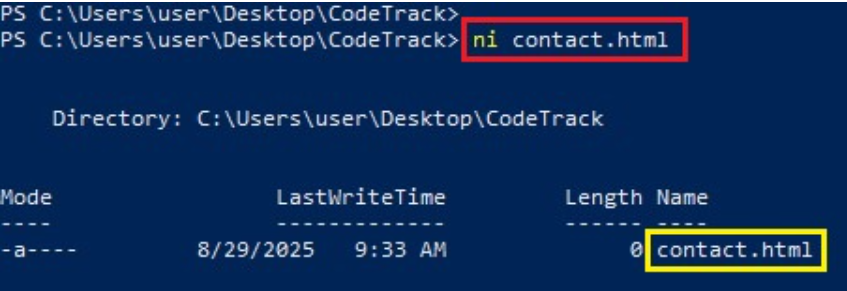 <br>
*Figure 68 – Created contact.html*

2. Add HTML content to `contact.html`:

```html
<!doctype html>
<html>
<head>
 <meta charset="utf-8">
 <title>Contact - CodeTrack</title>
 <link rel="stylesheet" href="style.css">
</head>
<body>
 <h1>Contact Us</h1>
 <p>Email: mail@pravinmishra.in</p>
 <p>Website: https://thecloudadvisory.com/</p>
</body>
</html>
```

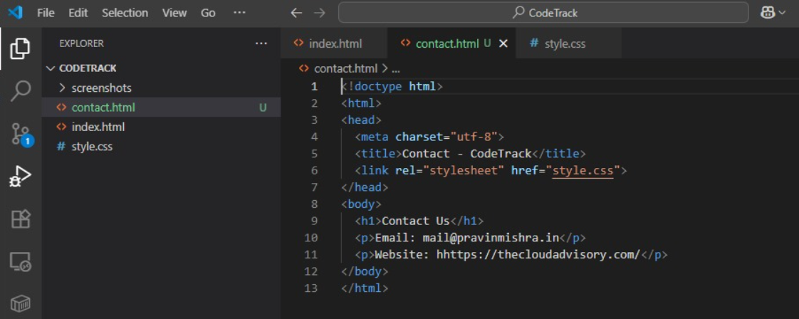 <br>
*Figure 69 – HTML content added to contact.html*

3. Stage and commit:

```bash
git add contact.html
git commit -m "feat(contact): add contact page with email and website"
```

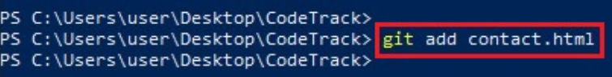 <br>
*Figure 70 – Contact page staged*

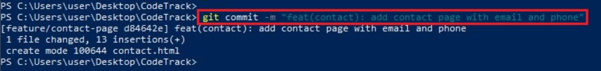 <br>
*Figure 71 – Contact page committed*

---

## Step 3 – Add Contact Page Link in `index.html`

**Goal:**
Update navigation in `index.html` to include the Contact Page link.

**Steps Performed:**

1. Add paragraph for Contact Page link below playlist section:

```html
<p class="playlist-line">
   Want to reach us? Visit the
   <a href="contact.html">Contact Page</a>.
</p>
```

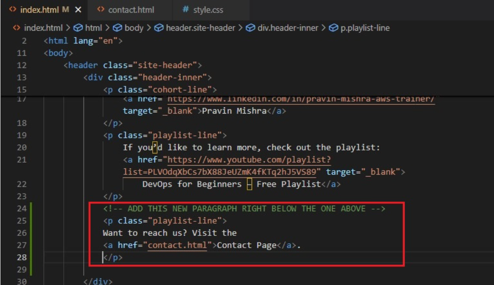 <br>
*Figure 72 – Added link to Contact Page*

2. Stage and commit:

```bash
git add index.html
git commit -m "feat(nav): add Contact Page link to index.html"
```

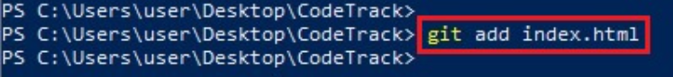 <br>
*Figure 73 – index.html staged*

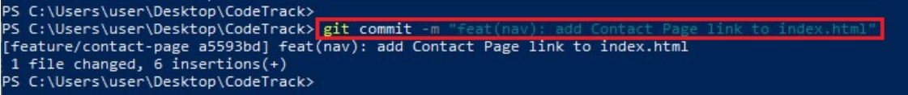 <br>
*Figure 74 – index.htmlcommitted*

---

## Step 4 – Verify Branch Isolation

**Goal:**
Ensure changes exist only on the feature branch and main branch remains unchanged.

**Steps Performed:**

1. Switch back to main:

```bash
git checkout main
```

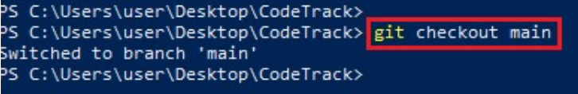 <br>
*Figure 75 – Switched to main branch*

2. Verify files:

```bash
ls
```

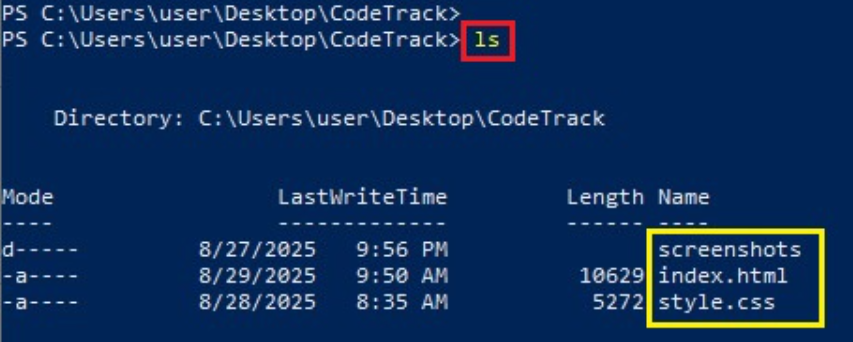 <br>
*Figure 76 – Contact.html not present on main*

3. Open `index.html` in a browser – Contact Page link should **not appear**.

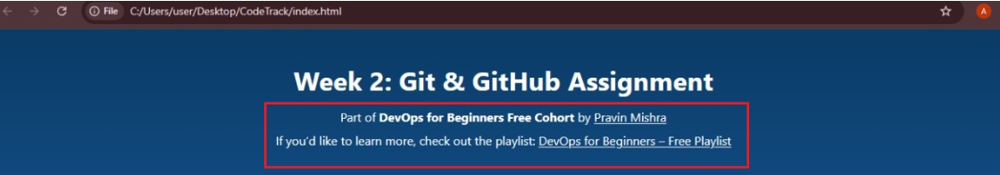 <br>
*Figure 77 – Contact Page link not present on main branch*

---

## Step 5 – Merge Feature Branch into Main

**Goal:**
Integrate tested changes into main branch.

**Steps Performed:**

1. Merge feature branch:

```bash
git merge feature/contact-page
```

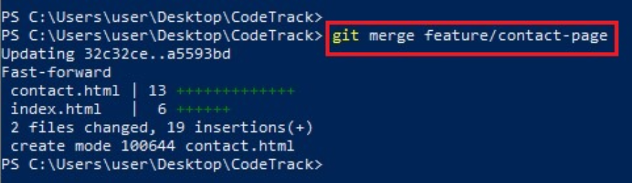 <br>
*Figure 79 – Merged feature branch into main*

2. Verify merged files:

```bash
ls
```

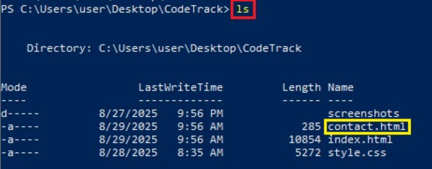 <br>
*Figure 80 – contact.html present on main*

3. Open `index.html` in browser – Contact Page link now appears.

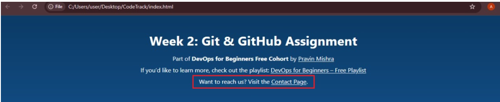 <br>
*Figure 81 – Contact Page link added on main*

---

## Step 6 – Inspect Git History

**Goal:**
Visualize the commit history and understand how branches were created and merged.

**Steps Performed:**

```bash
git log --oneline --graph --decorate --all
```

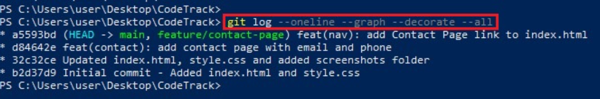 <br>
*Figure 84 – Git history with branch merges*

**Explanation:**

This command displays a **nice graph** view of the Git commit history, showing how different branches and commits are connected.

* `--oneline` → Shows each commit in a single line for easy reading
* `--graph` → Draws an ASCII graph showing branch and merge structure
* `--decorate` → Displays branch names, HEAD pointer, and tags
* `--all` → Shows commits from all branches, not just the current one

**Output Explanation:**

### Merge Commit Pointer Explanation

In the Git history output, the merge commit is marked with:

```
HEAD -> main, feature/contact-page
```

**What this indicates:**

* `HEAD` points to the branch you are currently on — in this case, `main`
* `main` and `feature/contact-page` both point to the **same merge commit**
* This confirms that the feature branch has been **successfully merged** into the main branch
* No additional commits exist exclusively in the feature branch after the merge

**Why this happens:**

After a successful merge:

* Git moves the `main` branch pointer forward to the merge commit
* The feature branch pointer still points to the same commit
* Since both pointers reference the same commit, Git displays them together

**How this appears in the graph:**

* The merge commit is where two lines join into one
* Branch labels appear together on that commit
* The history before the merge remains fully preserved

---

### Simple Takeaway

> `HEAD -> main, feature/contact-page` confirms a clean merge where both branches reference the same final commit.

This **nice graph** clearly confirms that the feature branch workflow was followed correctly and that changes were merged cleanly into the main branch.

---

## Step 7 – Optional Cleanup

**Goal:**
Keep repository clean by removing feature branch after merging.

```bash
git branch -d feature/contact-page
```

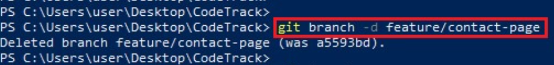 <br>
*Figure 85 – Feature branch deleted*

---

## Skills Gained

* Creating and managing feature branches in Git
* Committing changes with meaningful messages
* Updating navigation links without affecting main branch
* Isolating and verifying changes in branches
* Merging branches safely into main
* Visualizing Git history with graphs

---
