# Assignment 8 – Setting Up GitHub for CodeTrack

## Objective

Set up a **GitHub account**, explore essential GitHub features, and create a **professional GitHub profile** in preparation for working with remote repositories, pushing code, and collaborating on projects like **CodeTrack**.

This assignment focuses on **GitHub readiness**, not code changes.

---

## Step 1 – Create a GitHub Account

**Goal:**
Create a GitHub account and gain access to the GitHub Dashboard.

**Steps Performed:**

1. Signed up at GitHub using email, username, and password.
2. Completed verification and logged in successfully.
3. Accessed the GitHub Dashboard.

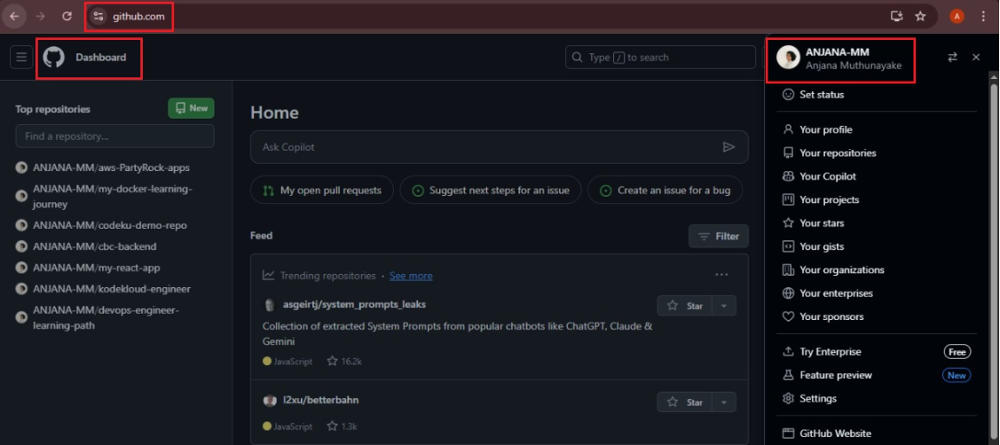  
*Figure 86 – GitHub dashboard after account creation*

**Expected Outcome:**
GitHub account successfully created and ready for use.

---

## Step 2 – Explore Core GitHub Features

**Goal:**
Understand how GitHub is used to discover, evaluate, and interact with open-source projects.

**Steps Performed:**

1. Opened the **Explore** section from the top navigation to browse popular repositories.

   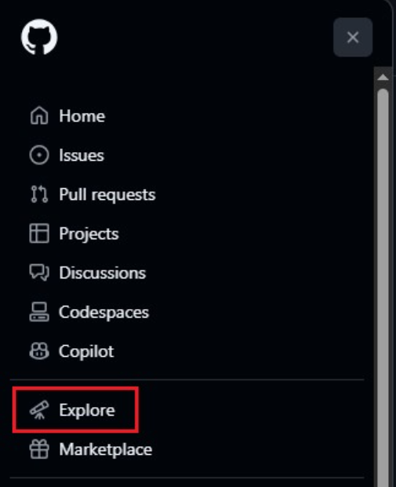  
   *Figure 87 – GitHub Explore section*

2. Browsed **Trending Repositories** to see what’s popular.

   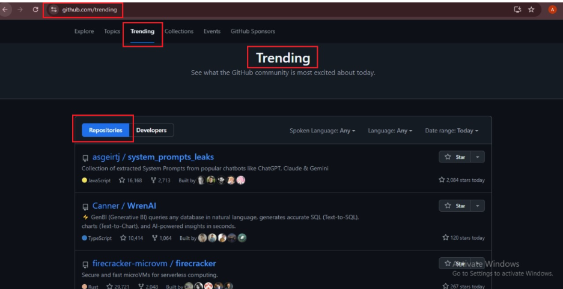  
   *Figure 88 – Trending repositories*

3. Used the search bar to find an open-source repository (`theepicbook`).

   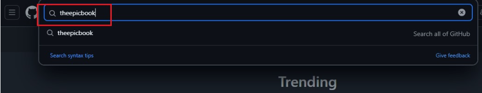  
   *Figure 89 – Search results for theepicbook*

4. ⭐ **Starred** a repository to save it for future reference.

   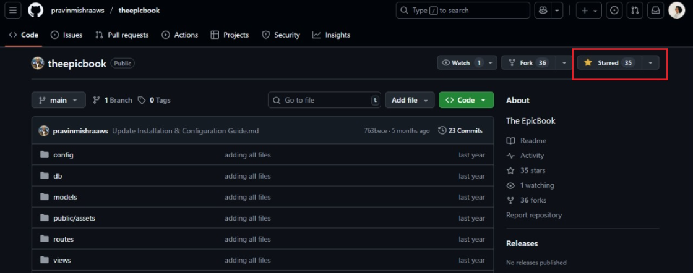  
   *Figure 90 – Starred repository*

5. 🍴 **Forked** a public repository to create a personal copy under your GitHub account.

   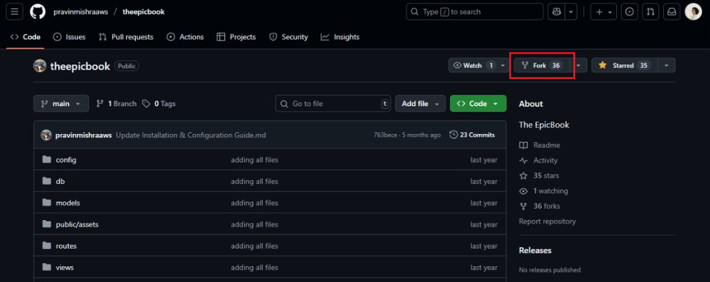  
   *Figure 91 – Fork repository*

   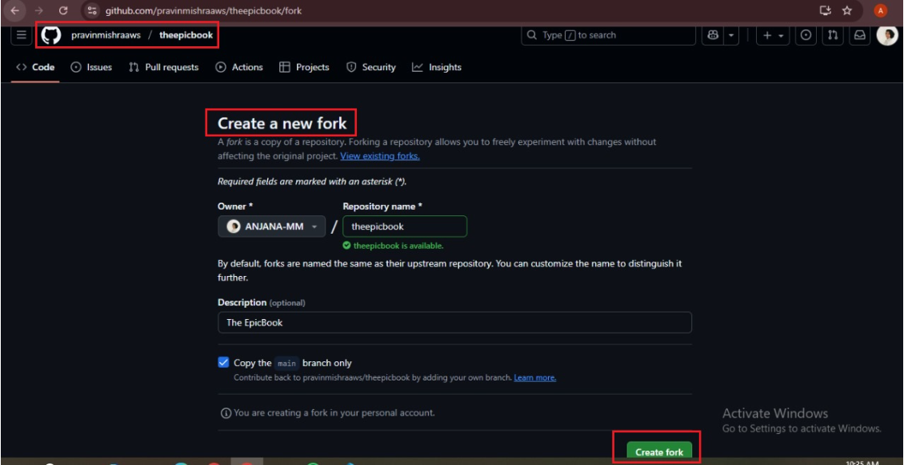  
   *Figure 92 – Create fork*

   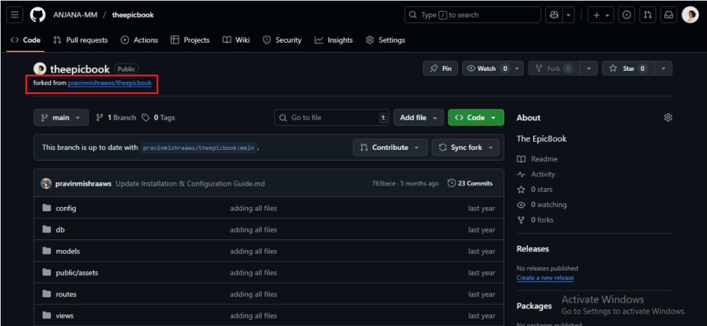  
   *Figure 93 – Forked repository under my account*

**Expected Outcome:**

* At least one repository starred
* At least one repository forked
* Basic familiarity with GitHub discovery and engagement features

---

## Step 3 – Verify Starred and Forked Repositories

**Goal:**
Confirm that interactions (stars and forks) are recorded under the user account.

**Steps Performed:**

1. Viewed **Starred repositories** from profile.
2. Viewed **Forked repositories** under repositories list.

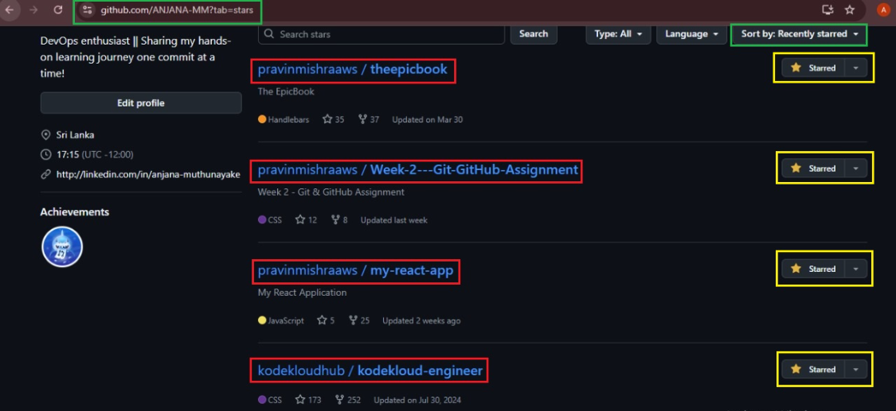  
*Figure 94 – Starred repositories*

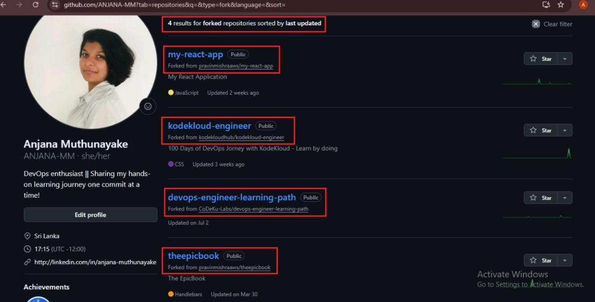  
*Figure 95 – Forked repositories*

---

## Step 4 – Update GitHub Profile

**Goal:**
Create a **professional GitHub profile** suitable for recruiters and collaborators.

**Steps Performed:**

1. Opened **Profile → Edit Profile**.
2. Added a short bio:

   > *Cloud & DevOps Enthusiast | Learning Git & GitHub*
3. Optionally added location and links.
4. Uploaded a profile picture.
5. Saved changes.

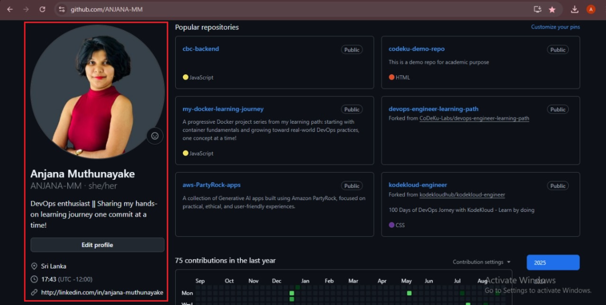  
*Figure 96 – Updated GitHub profile*

**Expected Outcome:**
GitHub profile appears personalized, professional, and complete.

---

## Why This Assignment Matters

This assignment prepares the foundation for:

* Pushing local repositories to GitHub
* Working with remotes (`origin`)
* Collaborating with teams
* Contributing to open-source projects
* Presenting a professional DevOps profile to recruiters

---

## Skills Gained

* Creating and managing a GitHub account
* Navigating GitHub Dashboard and Explore section
* Understanding stars and forks in open-source workflows
* Forking repositories for independent experimentation
* Creating a recruiter-friendly GitHub profile
* Preparing for remote Git and collaboration workflows

---

