# Assignment 9 – Collaborating on Mini-Finance with GitHub

## Objective

Practice a **real-world GitHub collaboration workflow** by forking a repository, configuring remotes (`origin` and `upstream`), syncing changes, creating a feature branch, and submitting a Pull Request.

This assignment simulates how developers contribute to **team and open-source projects** where direct push access to the main repository is restricted.

---

## Step 0 – Access Existing Mini-Finance Repository

### Goal

Identify the original (upstream) repository that we want to contribute to.

### Upstream Repository

```
https://github.com/pravinmishraaws/mini_finance
```

### Why this step is needed

In professional projects, contributors usually **do not have write access** to the main repository. Contributions are made via forks and pull requests.

---

## Step 1 – Fork the Repository

### Goal

Create a personal copy of the repository under your GitHub account.

### Steps Performed

1. Search for the `mini_finance` repository on GitHub.

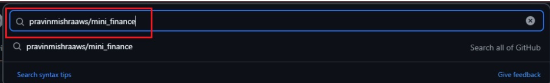
*Figure 1 – Search for mini_finance repository*

2. Click **Fork** and create a fork in your GitHub account.

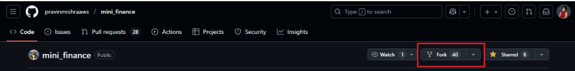
*Figure 2 – Forking the repository*

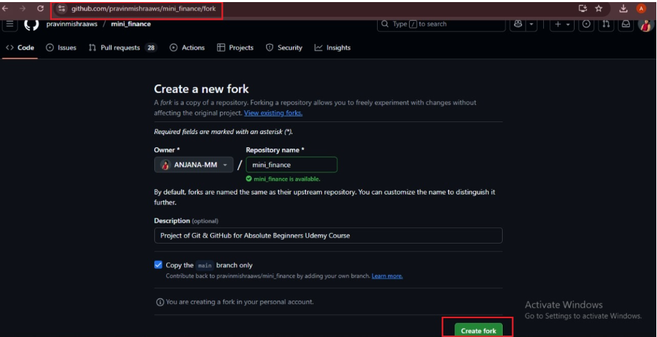
*Figure 3 – Create fork*

### Why we do this

Forking allows us to:

* Make changes safely
* Push commits without affecting the original project
* Propose changes via Pull Requests

---

## Step 2 – Configure GitHub Authentication (SSH) and Add Public Key

### Goal

Enable secure authentication between your local machine and GitHub, allowing password-free Git operations.

---

### 1. Generate a new SSH key on your local machine

```bash
ssh-keygen -t ed25519 -C "your.email@example.com"
```

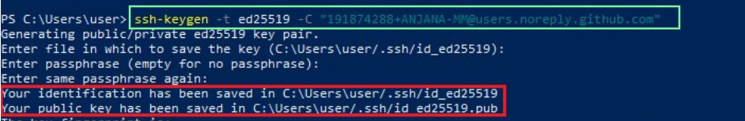
*Figure 4 – Generating SSH key*

#### Explanation

* Creates a new SSH key pair using the Ed25519 algorithm.
* Generates:

  * Private key: `id_ed25519`
  * Public key: `id_ed25519.pub`

---

### 2. Start the SSH agent and add your private key

#### Linux / macOS

```bash
eval "$(ssh-agent -s)"
ssh-add ~/.ssh/id_ed25519
```

#### Windows PowerShell

```powershell
Get-Service ssh-agent | Set-Service -StartupType Automatic
Start-Service ssh-agent

ssh-add $env:USERPROFILE\.ssh\id_ed25519
ssh-add -l
```

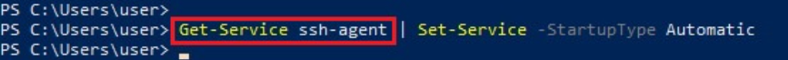
*Figure 5 – Configure SSH agent*

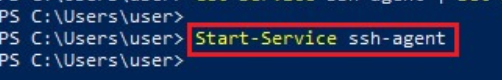
*Figure 6 – Start SSH agent*

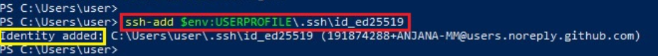
*Figure 7 – Adding private SSH key to SSH agent*


*Figure 8 – List SSH keys added to the SSH agent*

#### Explanation

* Starts the SSH agent.
* Adds your private key to the agent for the current session.
* Prevents repeated passphrase prompts.

---

### 3. View and copy the public key

```bash
cat ~/.ssh/id_ed25519.pub
```

#### Steps

1. Copy the entire output.
2. Open GitHub → **Settings → SSH and GPG Keys**.

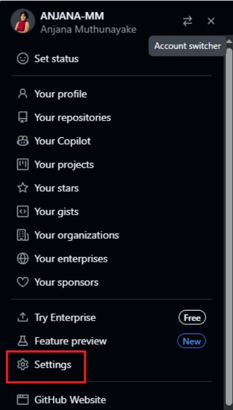
*Figure 9 – GitHub Settings*

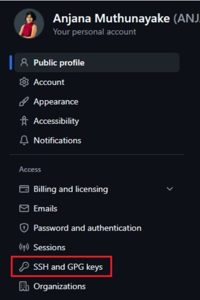
*Figure 10 – SSH and GPG Keys*

3. Click **New SSH key**.

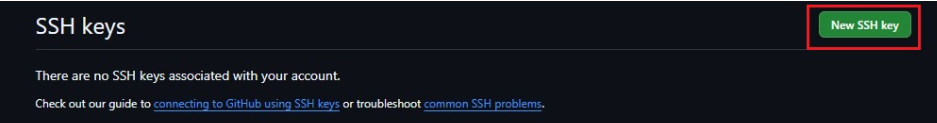
*Figure 11 – Create New SSH Key*

4. Paste the key, add a title, and click **Add SSH key**.

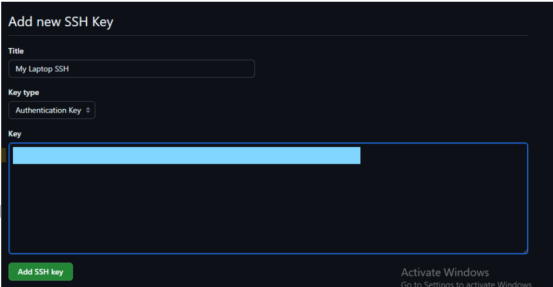
*Figure 12 – Adding SSH Public Key to GitHub*

5. Confirmation screen.

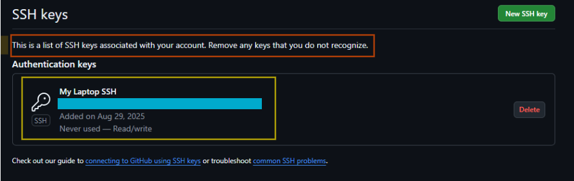
*Figure 13 – SSH Key Successfully Added*

---

### 4. Test SSH connection to GitHub

```bash
ssh -T git@github.com
```

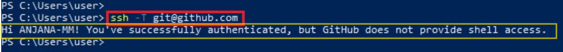
*Figure 14 – Testing SSH connection to GitHub*

#### Explanation

* `git@github.com` → `git` is GitHub’s SSH user.
* Confirms authentication without a password.

---

### 5. Configure Git to use SSH by default

```bash
git config --global url."git@github.com:".insteadOf "https://github.com/"
```

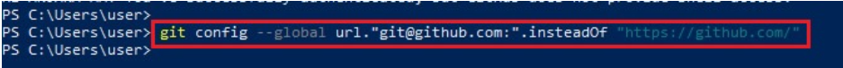
*Figure 15 – Configuring Git to Use SSH Instead of HTTPS*

#### Alternative (HTTPS)

```bash
git config --global credential.helper cache
```

---

### 6. Verify remote repository access

```bash
git ls-remote git@github.com:yourusername/mini_finance.git
```

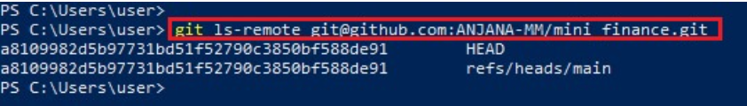
*Figure 16 – Verifying Remote Repository Access via SSH*

#### Expected Outcome

* Local machine authenticated with GitHub
* Git operations work without passwords

---

## Step 3 – Clone the Forked Repository Locally

### Goal

Create a local working copy of your fork.

```bash
git clone git@github.com:yourusername/mini_finance.git
cd mini_finance
```

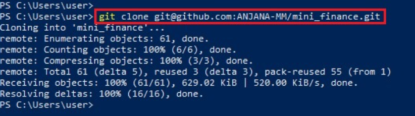
*Figure 17 – Cloning the forked repository*

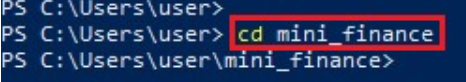
*Figure 18 – Navigate to the forked repository*

Verify remotes:

```bash
git remote -v
```

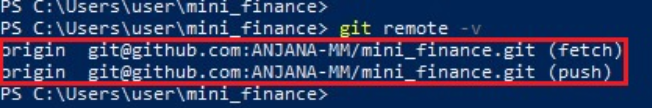
*Figure 19 – Listing Git remotes*

---

## Step 4 – Add Upstream Remote

### Goal

Link the local repository to the original repository.

```bash
git remote add upstream https://github.com/pravinmishraaws/mini_finance.git
git remote -v
```

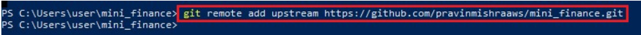
*Figure 20 – Adding upstream remote*

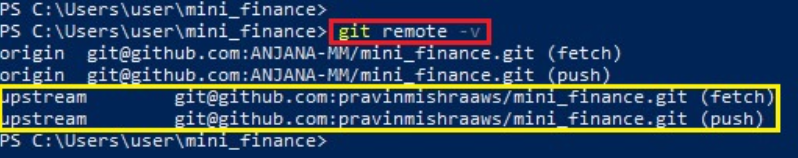
*Figure 21 – Verifying origin and upstream*

---

## Step 5 – Create Feature Branch

```bash
git checkout -b feature-readme-update
```

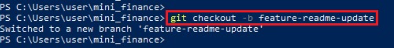
*Figure 22 – Feature branch created*

---

## Step 6 – Modify README and Commit Changes

```bash
git add README.md
git commit -m "docs: update README with assignment note"
```


*Figure 24 – Changes staged*

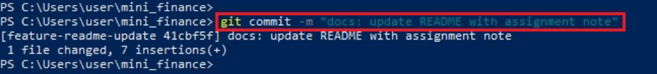
*Figure 25 – README committed*

---

## Step 7 – Sync with Upstream Repository

```bash
git fetch upstream
git checkout main
git merge upstream/main
git checkout feature-readme-update
git rebase main
```

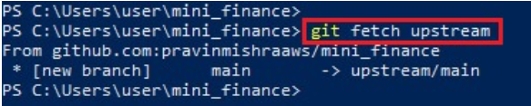
*Figure 26 – Fetching upstream changes*

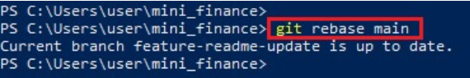
*Figure 30 – Rebasing feature branch*

---

## Step 8 – Push Feature Branch to Origin

```bash
git push -u origin feature-readme-update
```

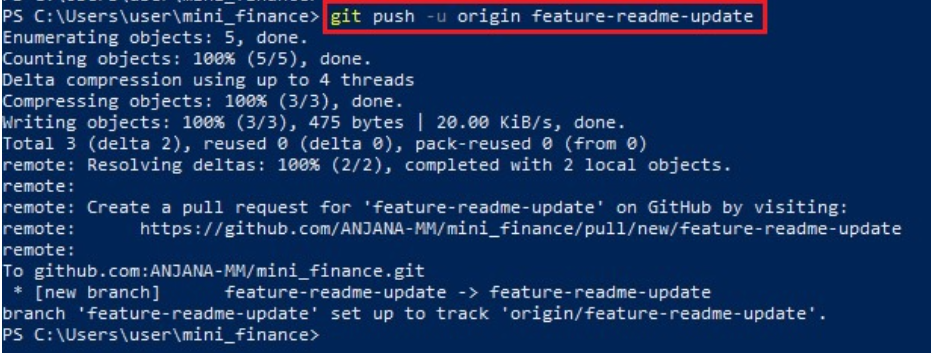
*Figure 31 – Feature branch pushed to origin*

---

## Step 9 – Create a Pull Request

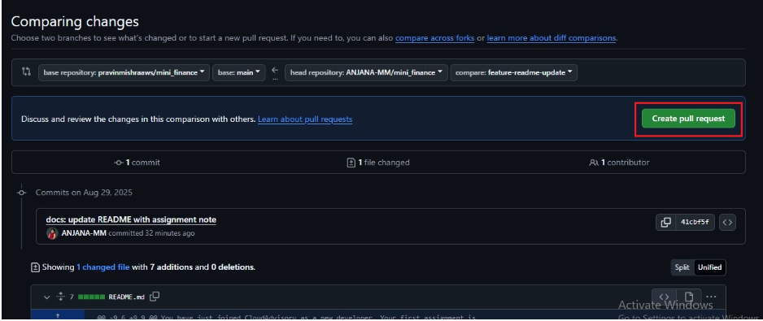
*Figure 35 – Create Pull Request*

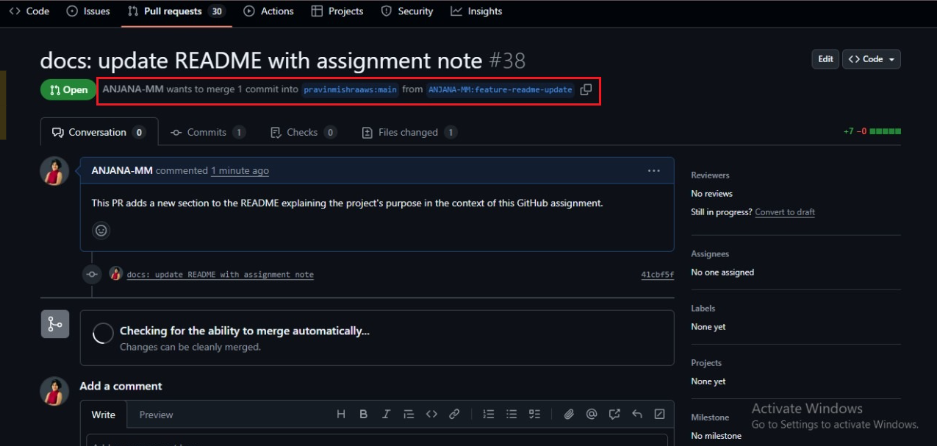
*Figure 37 – Pull Request submitted*

---

## Skills Gained

* Fork-based collaboration
* Remote management
* Rebasing
* Pull Requests
* Professional Git workflows

---

### Final Takeaway

> This assignment demonstrates professional GitHub collaboration using forks, feature branches, and pull requests.

---
